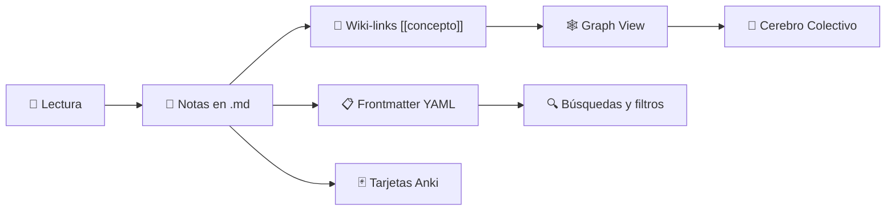

# 🏛️ Manifiesto del Proyecto: Filosofía en Ultralearning Dialéctico

> *«La filosofía no es una doctrina, sino una actividad. Una obra filosófica consiste esencialmente en elucidaciones.»*
> — **[[Wittgenstein]]**, *Tractatus Logico-Philosophicus*, 4.112

---

## 🎯 1. Misión y Visión

- **Misión:** Adquirir el «sistema operativo» de la filosofía formal — [[Lógica]], [[Argumentación]], análisis crítico y [[Ética]] — prescindiendo de la burocracia académica. El objetivo no es un título, sino la **transformación del pensamiento** mediante el rigor intelectual, la lectura profunda y la confrontación dialéctica.

- **Visión a 3 años:**
  - **Año 1:** Dominar el núcleo duro (materias obligatorias) del plan de estudios de Filosofía de la UNAM (SUAyED).
  - **Año 2:** Integrar el currículo de Pedagogía (enseñanza y transferencia del conocimiento).
  - **Año 3:** Integrar el currículo de Psicología (cognición, filosofía de la mente y percepción).

> [!IMPORTANT]
> Este no es un proyecto de acumulación de información. Es un proyecto de **formación del carácter intelectual**. Al final del Año 1, la métrica de éxito no es «cuántos libros leímos» sino «qué tan bien argumentamos, qué tan honestamente concedemos, qué tan claro escribimos».

---

## ⚙️ 2. El Motor Metodológico

Este proyecto rechaza el estudio pasivo. Se sostiene en cuatro pilares:

### Pilar 1 · [[Ultralearning]] (Directness & Drill)
Inmersión profunda sin distracciones. Eliminamos el «relleno» para ir directo a los textos primarios y la producción escrita. Se aprende filosofía *haciendo* filosofía: argumentando, objetando, reconstruyendo — no leyendo *sobre* filosofía.

### Pilar 2 · Active Recall y Repetición Espaciada
La memoria a largo plazo se **construye**. Las fechas, silogismos, términos griegos y alemanes viven en tarjetas de repaso diario (Anki). 5-10 minutos al día, todos los días, sin excepción.

### Pilar 3 · [[Principio de Feynman]]
Si no puedes explicar a [[Kant]] en términos simples, no has entendido a [[Kant]]. Se estudia para **enseñar**. Enseñar es la prueba más severa de comprensión.

### Pilar 4 · [[Método Dialéctico de Pares]]
Somos dos practicantes. Cada uno domina una mitad, la enseña, la reconstruye en su versión más fuerte ([[Principio de Caridad]]) y luego intenta destruirla con objeciones lógicas. El ajuste honesto es éxito, no fracaso.

---

## ⏱️ 3. Logística y Arquitectura del Tiempo

- **Carga semanal:** 20 horas netas por persona.
  - *Lunes a Viernes:* 2 horas diarias (inmersión, lectura, notas crudas, Anki).
  - *Fines de Semana:* 10 horas totales (mapeo, ensayo, choque dialéctico).

- **Ciclo Quincenal (La Unidad Operativa):** Cada materia obligatoria se conquista en bloques de **14 días** (40 horas totales).

| Bloque | Días | Actividad | Horas |
|:------:|:----:|:----------|:-----:|
| 🌅 **Reconocimiento** | 1 – 7 | Reconocimiento del terreno, identificación del texto-eje, primera lectura corrida | ~14 hrs |
| 🔬 **Disección** | 8 – 12 | Lectura con escalpelo, disección argumentativa, mapeo conceptual | ~12 hrs |
| ⚔️ **Confrontación** | 13 – 14 | Confrontación dialéctica, redacción del ensayo final, registro de preguntas | ~14 hrs |

> [!TIP]
> La velocidad real de comprensión filosófica está cerca de **10 a 15 páginas serias de fuente primaria al día**, no 50. Acepta ese ritmo desde el principio: leer menos textos *bien* es siempre mejor que leer más textos *mal*. La filosofía premia profundidad sobre cobertura.

---

## 🛠️ 4. El Stack Tecnológico

La herramienta sirve al estudio, no al revés.

| Herramienta | Función | Cómo la usamos |
|:------------|:--------|:---------------|
| **Obsidian** | 🧠 El Cerebro Horizontal | Nuestro [[Zettelkasten]]. Aquí viven los temarios expandidos, los mapas conceptuales, el cuaderno de lugares comunes (organizado por **problema**, no por autor) y el registro de preguntas no resueltas. Cada concepto es un `[[enlace]]` que construye la red de conocimiento. |
| **Anki** | 💪 El Músculo Retentivo | Revisión espaciada para las microtareas en tiempos muertos (transporte, pausas). Definiciones técnicas, formas argumentales, términos griegos/alemanes/latinos. |
| **Kindle / Papel** | 📖 El Protector Visual | La lectura densa se hace fuera de pantallas LCD para evitar la fatiga visual y proteger la atención profunda. Marcar el mismo ejemplar en tres lecturas es parte del método. |
| **NotebookLM / Gemini** | 🔍 El Tercer Lector | IA configurada como crítico implacable para auditar nuestros ensayos, buscar [[Falacia]]s lógicas y evitar la cámara de eco. |

### 📊 Flujo de Trabajo en Obsidian

> [!NOTE]
> **Sobre los wiki-links:** No necesitan crear bases de datos complejas. Basta con encerrar cada concepto entre corchetes `[[Justicia]]` cada vez que lo mencionen. Con el tiempo, el **Graph View** se convertirá literalmente en el mapa de su cerebro colectivo: cada nodo un concepto, cada arista una conexión que ustedes descubrieron.

> [!NOTE]
> **Sobre el Frontmatter:** Cada archivo `.md` incluye metadatos YAML al inicio (`Materia`, `Estado`, `Autores_clave`, `Conceptos_clave`, `tags`). Esto permite hacer búsquedas brutales y filtrar todo el sistema en segundos cuando lleguen a exámenes o debates finales. Usen el plugin **Dataview** en Obsidian para consultas tipo base de datos.

---

## 📜 5. Las 5 Reglas de Oro (Innegociables)

> *Cuando el método falla, casi siempre es porque una de estas cinco se relajó.*

| # | Regla | Esencia |
|:-:|:------|:--------|
| 1 | **Producción Escrita** | Lo que no se escribe, no se entendió. Cada fase exige un artefacto (mapa, resumen, ensayo). |
| 2 | **Concesión Honesta** | En el debate, el objetivo es la verdad, no ganar. Quien nota un error en su argumento, lo concede inmediatamente y sin ego. |
| 3 | **Retorno al Texto** | Las disputas se zanjan volviendo al libro y leyendo el párrafo original, no apelando a la memoria. |
| 4 | **Tolerancia a la [[Aporía]]** | Está bien no entender a [[Hegel]] a la primera. La incomprensión productiva es mejor que la falsa certeza. |
| 5 | **Silencio Productivo** | Mientras el compañero expone, se anota. No se interrumpe para micro-correcciones hasta que llegue el momento del interrogatorio. |

> [!WARNING]
> **Señal de alarma:** Si en alguna sesión *nadie concedió nada y nadie objetó nada serio*, el método se está degradando hacia la lectura compartida cómoda. Es momento de recalibrar.

---

## ⚖️ 6. Sistema de Evaluación

Cada materia termina con dos productos:

### 📝 El Artefacto Escrito
- **Formato estándar:** Ensayo de 1,000 a 1,500 palabras (formato APA) con una hipótesis clara y argumentación rigurosa.
- **Formato técnico** (para materias como [[1158 - Lógica I]]): Demostración Analítica — formalización y prueba de validez de un argumento filosófico clásico.
- El ensayo debe contener: tesis explícita, argumento principal, objeción anticipada, respuesta a la objeción.

### ⚔️ La Defensa Dialéctica
- El ensayo debe sobrevivir a la refutación del compañero (o del «Tercero Ausente»).
- Protocolo: Silencio Productivo → [[Principio de Caridad]] (reconstruir el argumento del otro en su versión más fuerte) → Confrontación → Registro de preguntas no resueltas.

### 📊 Auditoría Mensual
- El último día del mes, evaluamos el **método**, no la filosofía:
  - ¿Cumplimos las horas?
  - ¿Faltó caridad en los debates?
  - ¿Qué reglas dejamos de cumplir y con qué consecuencias?
  - ¿Qué ajustamos para el próximo mes?

---

## 🗺️ 7. Mapa del Primer Año

```mermaid
graph TD
    S1["📅 Semestre 1"]
    S2["📅 Semestre 2"]
    S3["📅 Semestre 3"]
    S4["📅 Semestre 4"]

    S1 --> A["[[1156 - Introducción a la Filosofía I]]"]
    S1 --> B["[[1157 - Historia de la Filosofía I]]"]
    S1 --> C["[[1158 - Lógica I]]"]

    S2 --> D["[[1205 - Historia de la Filosofía II-1]]"]
    S2 --> E["[[1206 - Lógica II]]"]
    S2 --> F["[[1207 - Introducción a la Filosofía II]]"]

    S3 --> G["[[1305 - Historia de la Filosofía II-2]]"]
    S3 --> H["[[1306 - Ontología - Metafísica]]"]
    S3 --> I["[[1307 - Ética]]"]

    S4 --> J["[[1400 - Historia de la Filosofía III-1]]"]
    S4 --> K["[[1401 - Teoría del Conocimiento]]"]
    S4 --> L["[[1402 - Estética]]"]

    style S1 fill:#e94560,stroke:#1a1a2e,color:#ffffff,stroke-width:2px
    style S2 fill:#0f3460,stroke:#1a1a2e,color:#ffffff
    style S3 fill:#533483,stroke:#1a1a2e,color:#ffffff
    style S4 fill:#2b2d42,stroke:#1a1a2e,color:#ffffff
```

---

## 🔥 8. Recordatorio Final

> *«Gana el método que sigues haciendo en el mes catorce.»*

No se trata de intensidad heroica, sino de **constancia inteligente**. La semana imposible se declara al inicio del ciclo y se compensa después, sin recriminación. La culpa mata más métodos que la pereza.

Somos dos personas con compromiso firme que quieren adentrarse en la filosofía como **practicantes serios**: argumentar con precisión, leer con profundidad, objetar con caridad, conceder con honestidad y producir pensamiento propio sostenido en lectura rigurosa.

> *«Una vida sin examen no merece ser vivida.»*
> — **[[Sócrates]]**, en [[Platón]], *Apología*, 38a

---

*Documento fundacional del proyecto MDP · v2.0 · Junio 2026*