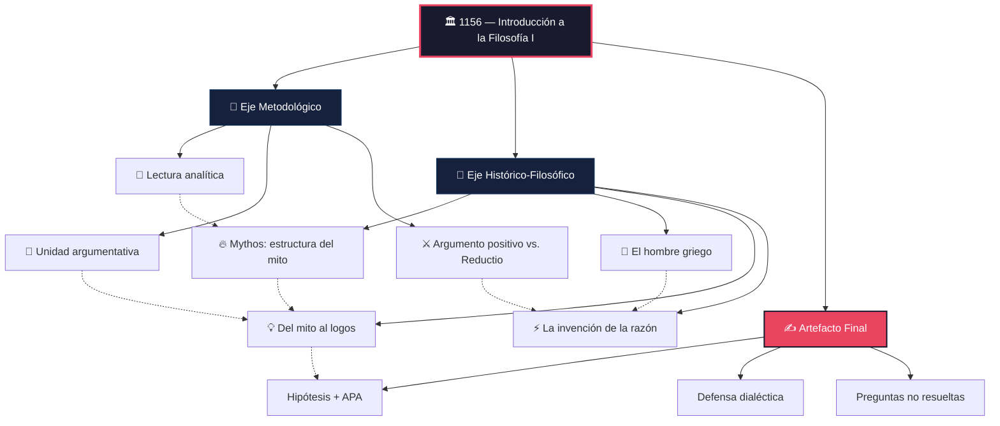
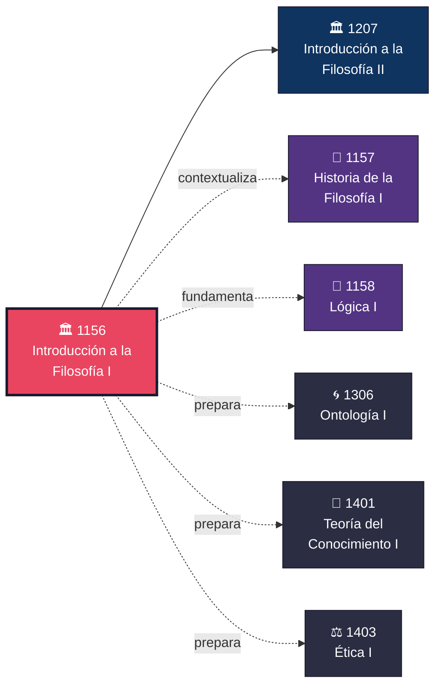

# 🏛️ 1156 — Introducción a la Filosofía, Principios y Técnicas de la Investigación Filosófica I

> *«La filosofía comienza con el asombro.»*
> — **[[Aristóteles]]**, *Metafísica*, 982b

> *«Una vida sin examen no merece ser vivida.»*
> — **[[Sócrates]]**, en [[Platón]], *Apología*, 38a

---

> [!IMPORTANT]
> **🔥 Pilares del [[Manifiesto]] aplicables a esta materia:**
> - **[[Principio de Feynman]]:** Estudias para poder enseñar a tu par cómo leer filosóficamente. Si no puedes explicar la diferencia entre [[Mythos]] y [[Logos]] con tus propias palabras, no la entiendes.
> - **Drill (Ultralearning):** La [[lectura analítica]] se domina con práctica repetida sobre textos reales — no con resúmenes de segunda mano.
> - **Producción Escrita:** El ensayo de 5 cuartillas es tu prueba de fuego. Sin escritura, no hay pensamiento filosófico.
> - **Retorno al Texto:** Las disputas sobre el mito y el logos se zanjan releyendo a [[Eliade]] y [[Vernant]], no opinando en abstracto.
> - **Silencio Productivo:** Antes de refutar, escucha. La [[Aporía]] genuina es más valiosa que la respuesta apresurada.

---

## 📋 Ficha de Identificación

| Campo | Detalle |
|:------|:--------|
| **Clave** | 1156 |
| **Asignatura** | Introducción a la Filosofía, Principios y Técnicas de la Investigación Filosófica I |
| **Semestre** | 1.º |
| **Área** | Introducción / Metodología |
| **Carácter** | Obligatoria |
| **Créditos** | 6 |
| **Horas teóricas / sem.** | 3 |
| **Modalidad** | SUAyED — Sistema Universidad Abierta y Educación a Distancia |
| **Plan de estudios** | Licenciatura en Filosofía, Facultad de Filosofía y Letras, UNAM |
| **Seriación** | Ninguna (primer contacto con la carrera) |
| **Duración MDP** | 14 días / 40 horas totales |
| **Texto-eje** | [[Pryor]], *Guidelines on Reading Philosophy* |

---

## 🌅 Descripción General del Curso

La asignatura **Introducción a la Filosofía I** es el umbral donde se cruzan dos aprendizajes simultáneos: *aprender a leer filosóficamente* y *comprender el nacimiento mismo de la filosofía* como actividad racional diferenciada del mito.

No se trata de un recorrido enciclopédico por todos los problemas filosóficos —eso vendrá en semestres posteriores— sino de un **entrenamiento intensivo** en dos ejes:

1. **Eje Metodológico:** Adquirir las herramientas de la [[lectura analítica]] y la [[argumentación filosófica]] siguiendo la guía de [[Pryor|James Pryor]], uno de los filósofos analíticos contemporáneos que mejor ha codificado *cómo* se lee y *cómo* se argumenta en filosofía.

2. **Eje Histórico-Filosófico:** Investigar la transición del [[Mythos]] al [[Logos]] en la Grecia antigua, comprendiendo los factores discursivos, políticos y culturales que hicieron posible el nacimiento de la [[Filosofía]] como forma autónoma de pensamiento.

Al final del ciclo de 14 días, el estudiante habrá producido un ensayo argumentativo respondiendo a la pregunta: *¿Cuáles fueron los elementos discursivos y políticos que contribuyeron a la separación del mito y el logos en la Grecia antigua?*

---

## 🎯 Objetivos de Aprendizaje

Al finalizar este ciclo, el estudiante será capaz de:

1. **Aplicar** las técnicas de [[lectura analítica]] de [[Pryor]] para identificar [[unidad argumentativa|unidades argumentativas]] en textos filosóficos reales.
2. **Distinguir** entre [[Argumento positivo|argumentos positivos]] y argumentos por [[Reducción al absurdo|reducción al absurdo]], reconociendo su estructura lógica.
3. **Explicar** la estructura y función del [[Mythos|pensamiento mítico]] según [[Eliade]] y su relación con lo sagrado.
4. **Analizar** la transición del mito al [[Logos]] en la cultura griega, identificando los factores que [[Vernant]], [[Morey]] y [[Châtelet]] señalan como decisivos.
5. **Redactar** un ensayo filosófico de máximo 5 cuartillas con tesis clara, estructura argumentativa sólida y formato APA.
6. **Defender** dialécticamente su tesis ante un par, aplicando el [[Principio de Caridad]] y el [[Método Dialéctico de Pares]].

---

## 🗺️ Mapa Conceptual General

---

## 📚 Temario Detallado — Estructura de 3 Fases

---

### ⚡ Fase I — Adquisición de Método + Pensamiento Mítico

**📅 Días 1–7 · ≈ 14 horas · Reconocimiento y primera lectura**

> *«Leer filosofía no es como leer una novela. No estás buscando qué sucede después, sino qué se sigue de qué.»*
> — **[[Pryor|James Pryor]]**, *Guidelines on Reading Philosophy*

Esta fase tiene un doble objetivo: aprender *cómo se lee* un texto filosófico (eje metodológico) y sumergirse en la lógica del [[pensamiento mítico]] antes de su superación por la razón (eje histórico-filosófico).

#### 📐 Eje Metodológico

- [ ] **[[Pryor]], James.** *Guidelines on Reading Philosophy* (2006)
  - Concepto de [[lectura analítica]]: leer para reconstruir argumentos, no para «entender la idea general»
  - Identificación de la [[unidad argumentativa]]: premisas, conclusión, supuestos tácitos
  - Técnica de la lectura en dos pasadas: panorámica → analítica
  - La importancia de formular la tesis del autor *en tus propias palabras* ([[Principio de Feynman]])

#### 🌿 Eje Histórico-Filosófico

- [ ] **[[Eliade]], Mircea.** «La estructura de los mitos» en *Mito y realidad*, pp. 7–27
  - ¿Qué es un mito? El mito como relato sagrado de los orígenes
  - Mito y tiempo: el *illud tempus* y el eterno retorno
  - La función del mito en las sociedades arcaicas: cosmogonía, legitimación, sentido

- [ ] **[[Vernant]], Jean-Pierre.** «El hombre griego» en *El hombre griego*, pp. 9–31
  - La singularidad del mundo griego: *polis*, publicidad de la palabra, isonomía
  - El paso de la palabra-mágica a la palabra-argumento
  - ¿Por qué Grecia? Condiciones socio-políticas del nacimiento de la razón

> [!NOTE]
> **Dinámica de la Fase I:**
> - **Días 1–2:** Lectura intensiva de [[Pryor]]. Objetivo: comprender qué es una «[[unidad argumentativa]]» y practicar la técnica de las dos pasadas con un texto breve.
> - **Días 3–5:** Lectura de [[Eliade]] y [[Vernant]] aplicando las técnicas de Pryor. Subrayar las tesis centrales, identificar las premisas de cada argumento.
> - **Días 6–7:** Extracción de conceptos clave, creación de tarjetas [[Anki]], elaboración de mapa visual integrando ambos ejes.

---

### 🔨 Fase II — Construcción Lógica + Nacimiento de la Razón

**📅 Días 8–12 · ≈ 10–12 horas · Lectura con escalpelo y disección argumentativa**

> *«La filosofía no nace del asombro; nace cuando alguien exige razones.»*
> — Paráfrasis de [[Châtelet]]

En esta fase el estudiante refina sus herramientas argumentativas (tipos de argumento, vocabulario lógico) y las aplica a los textos que narran el paso del [[Mythos]] al [[Logos]]: la invención griega de la razón como instrumento autónomo.

#### 📐 Eje Metodológico

- [ ] **[[Pryor]], James.** *What is An Argument?*
  - Definición rigurosa de argumento: no opinión, no relato, no exhortación
  - Estructura: premisas explícitas + premisas implícitas → conclusión
  - La diferencia entre argumentos *buenos* (sólidos) y argumentos *válidos*

- [ ] **[[Pryor]], James.** *Vocabulary Describing Arguments*
  - [[Argumento positivo]]: ofrecer razones directas a favor de una conclusión
  - [[Reducción al absurdo]] (*reductio ad absurdum*): mostrar que negar la conclusión conduce a una contradicción
  - Vocabulario técnico: *premisa*, *conclusión*, *objeción*, *réplica*, *supuesto*, *implicación*

#### 🌿 Eje Histórico-Filosófico

- [ ] **[[Morey]], Miguel.** *Los presocráticos. Del mito al logos*, pp. 9–23
  - El concepto de [[arché]]: la búsqueda de un principio racional del cosmos
  - [[Tales]], [[Anaximandro]], [[Anaxímenes]]: las primeras explicaciones no míticas
  - ¿Continuidad o ruptura? El logos como transformación —no eliminación— del mythos

- [ ] **[[Châtelet]], François.** «La invención de la razón» en *Una historia de la razón*, pp. 15–37
  - La razón no como *descubrimiento* sino como *invención* histórica
  - El rol de la [[polis]] democrática: el ágora como espacio de argumentación
  - La palabra que demuestra vs. la palabra que encanta
  - Política y [[Logos]]: igualdad ante la ley, igualdad ante el argumento

> [!NOTE]
> **Dinámica de la Fase II:**
> - **Días 8–9:** Lectura de los dos textos de [[Pryor]] sobre argumentación. Practicar identificando argumentos positivos y reductios en ejemplos breves.
> - **Días 10–12:** Lectura de [[Morey]] y [[Châtelet]] rastreando la estructura argumentativa de cada autor. ¿Qué argumentos dan para explicar el paso del mito al logos? ¿Son argumentos positivos o reductios?
> - **Noche del Día 12:** Elegir tu hipótesis para el ensayo final. Escribir un párrafo provisional con tu tesis.

---

### ⚔️ Fase III — Combate Dialéctico + Producción Escrita

**📅 Días 13–14 · ≈ 14 horas · Ensayo y defensa dialéctica**

> *«No se filosofa en soledad: se filosofa contra alguien, con alguien, para alguien.»*
> — Espíritu del [[Método Dialéctico de Pares]]

Esta es la fase culminante. Todo lo aprendido converge en un acto de **producción escrita** y en un **ritual de confrontación dialéctica** con tu par de estudio.

#### ✍️ Día 13 (Sábado) — Jornada de escritura

- [ ] Redacción completa del ensayo (ver sección **Artefacto Final** abajo)
- [ ] Revisión de estructura: ¿la tesis es clara desde el primer párrafo?
- [ ] Verificación de aparato crítico: ¿citas en formato APA? ¿fuentes primarias correctamente referenciadas?
- [ ] Lectura en voz alta del ensayo completo (técnica [[Principio de Feynman|Feynman]])

#### 🗣️ Día 14 (Domingo) — Confrontación dialéctica

- [ ] **Intercambio de ensayos** con tu par de estudio
- [ ] **Silencio Productivo** (30 min): Leer el ensayo del otro en silencio, anotando preguntas y objeciones *sin hablar*
- [ ] **[[Principio de Caridad]]** (15 min): Reformular la tesis del otro *en su mejor versión posible*
- [ ] **Confrontación** (45 min): Cada uno defiende su tesis; el otro presenta objeciones razonadas
- [ ] **Registro de [[Aporía|aporías]]**: Anotar las preguntas que quedaron genuinamente abiertas

---

## 🎯 Artefacto Final

> [!CAUTION]
> **Este es el producto evaluable del ciclo de 14 días.** Sin ensayo terminado y sin defensa dialéctica, el ciclo no se considera completado. La escritura filosófica no es un adorno: es el pensamiento hecho carne.

### 📝 El Ensayo

| Elemento | Especificación |
|:---------|:---------------|
| **Pregunta rectora** | *¿Cuáles fueron los elementos discursivos y políticos que contribuyeron a la separación del [[Mythos|mito]] y el [[Logos|logos]] en la Grecia antigua?* |
| **Extensión** | Máximo 5 cuartillas (1000–1500 palabras) |
| **Formato** | APA, 7.ª edición |
| **Requisito estructural** | Hipótesis clara y explícita en el primer párrafo |
| **Fuentes mínimas** | Al menos 3 de los textos del temario (se exige al menos 1 del eje metodológico y 2 del eje histórico-filosófico) |
| **Entrega** | Día 13 (noche) |

### 🗣️ La Defensa Dialéctica

| Elemento | Especificación |
|:---------|:---------------|
| **Modalidad** | Intercambio de ensayos + confrontación oral |
| **Protocolo** | Silencio Productivo → [[Principio de Caridad]] → Confrontación → Registro de aporías |
| **Duración** | ≈ 90 minutos |
| **Producto** | Lista de preguntas no resueltas (se integra a la sección *Preguntas No Resueltas* abajo) |
| **Fecha** | Día 14 |

---

## 📅 Calendario de 14 Días

> [!TIP]
> Cada día indica la actividad principal y las horas sugeridas. El ciclo totaliza ~40 horas. Ajusta según tu ritmo, pero respeta la secuencia: *método antes de contenido, contenido antes de producción*.

| Día | Fase | Actividad principal | Hrs |
|:---:|:----:|:---------------------|:---:|
| 1 | I | 📖 Lectura intensiva de [[Pryor]], *Guidelines on Reading Philosophy* (1.ª pasada completa) | 2 |
| 2 | I | 📖 Re-lectura de [[Pryor]] con notas; practicar identificación de [[unidad argumentativa|unidades argumentativas]] en un texto breve | 2 |
| 3 | I | 📖 Lectura de [[Eliade]], «La estructura de los mitos» — aplicando técnica Pryor | 2 |
| 4 | I | 📖 Lectura de [[Vernant]], «El hombre griego» — aplicando técnica Pryor | 2 |
| 5 | I | 🔬 Re-lectura selectiva de [[Eliade]] y [[Vernant]]; subrayado de tesis y premisas centrales | 2 |
| 6 | I | 🧠 Extracción de conceptos → creación de tarjetas [[Anki]] (Fase I) | 2 |
| 7 | I | 🗺️ Elaboración de mapa visual integrando eje metodológico + eje histórico-filosófico | 2 |
| 8 | II | 📖 Lectura de [[Pryor]], *What is An Argument?* — toma de notas | 2 |
| 9 | II | 📖 Lectura de [[Pryor]], *Vocabulary Describing Arguments* + ejercicios de identificación | 2 |
| 10 | II | 📖 Lectura de [[Morey]], *Del mito al logos* — rastreo de estructura argumentativa | 2 |
| 11 | II | 📖 Lectura de [[Châtelet]], «La invención de la razón» — rastreo de estructura argumentativa | 2–3 |
| 12 | II | 🧠 Tarjetas [[Anki]] (Fase II) + formulación de hipótesis para el ensayo | 2–3 |
| **13** | **III** | **✍️ Jornada de escritura: redacción completa del ensayo** | **6–7** |
| **14** | **III** | **⚔️ Defensa dialéctica + registro de aporías** | **6–7** |

---

## 🔄 Protocolo de Inmersión MDP — Ciclo de 14 Días

> [!TIP]
> Este protocolo adapta las siete fases genéricas del MDP a la estructura real de este curso. Marca cada casilla solo cuando hayas completado genuinamente la actividad.

| Fase MDP | Días | Actividad | Estado |
|:--------:|:----:|:----------|:------:|
| 🌱 **Reconocimiento** | 1–2 | Lectura completa de [[Pryor]]; comprensión del concepto de [[unidad argumentativa]] | ☐ |
| 🗺️ **Cartografía** | 3–5 | Lectura de [[Eliade]] y [[Vernant]] aplicando técnicas de Pryor; primera reconstrucción del paisaje [[Mythos]]-[[Logos]] | ☐ |
| 🧠 **Consolidación I** | 6–7 | Extracción de conceptos, tarjetas [[Anki]], mapa visual integrador | ☐ |
| 📖 **Lectura con escalpelo** | 8–9 | Textos de [[Pryor]] sobre argumentación; práctica de disección lógica | ☐ |
| 🔬 **Disección argumentativa** | 10–12 | [[Morey]] y [[Châtelet]] leídos como *argumentos* sobre el origen de la razón; formulación de hipótesis | ☐ |
| ✍️ **Producción escrita** | 13 | Redacción completa del ensayo (máx. 5 cuartillas, APA) | ☐ |
| ⚔️ **Combate dialéctico** | 14 | Intercambio de ensayos, defensa con [[Principio de Caridad]], registro de aporías | ☐ |

---

## 📖 Textos y Lecturas

> [!TIP]
> Los textos del **Temario Híbrido** son obligatorios y están organizados por fase. Los de **Referencia y Complementarios** son herramientas de apoyo que te acompañarán más allá de este ciclo.

### Textos del Temario — Eje Metodológico

| Fase | Autor | Título | Notas |
|:----:|:------|:-------|:------|
| I | **[[Pryor]], James** | *Guidelines on Reading Philosophy* (2006) | Texto-eje de todo el curso. Aprender a leer = aprender a filosofar |
| II | **[[Pryor]], James** | *What is An Argument?* | Definición rigurosa: qué cuenta como argumento y qué no |
| II | **[[Pryor]], James** | *Vocabulary Describing Arguments* | Léxico técnico: [[Argumento positivo]], [[Reducción al absurdo|reductio]], premisa, objeción |

### Textos del Temario — Eje Histórico-Filosófico

| Fase | Autor | Título | Editorial / Páginas | Notas |
|:----:|:------|:-------|:---------------------|:------|
| I | **[[Eliade]], Mircea** | «La estructura de los mitos» en *Mito y realidad* | pp. 7–27 | Qué es un mito; función cosmogónica; el *illud tempus* |
| I | **[[Vernant]], Jean-Pierre** | «El hombre griego» en *El hombre griego* | pp. 9–31 | La singularidad griega; [[polis]], isonomía, palabra pública |
| II | **[[Morey]], Miguel** | *Los presocráticos. Del mito al logos* | pp. 9–23 | El concepto de [[arché]]; la razón como búsqueda de principios |
| II | **[[Châtelet]], François** | «La invención de la razón» en *Una historia de la razón* | pp. 15–37 | La razón como invención política; el ágora y el [[Logos]] |

### Fuentes de Referencia y Complementarias

| Prioridad | Autor | Título | Editorial / Edición | Notas |
|:---------:|:------|:-------|:---------------------|:------|
| ⭐ Referencia | **[[Ferrater Mora]], José** | *Diccionario de filosofía* (4 vols.) | Ariel, ed. actualizada | Referencia enciclopédica en español; consulta permanente |
| 📘 Complementaria | **[[Nagel]], Thomas** | *¿Qué significa todo esto?* | FCE, trad. L. P. Villacañas | Introducción magistral; ideal para acompañar la Fase I |
| 📘 Complementaria | **[[Russell]], Bertrand** | *Los problemas de la filosofía* | Labor / Austral | Clásico introductorio; útil para panorámica de problemas |
| 📘 Complementaria | **[[Jaspers]], Karl** | *La filosofía desde el punto de vista de la existencia* | FCE, trad. J. Gaos | ¿Qué es filosofar? Profundiza la pregunta de la Fase I |
| 📗 Opcional | **Adler, Mortimer & Van Doren, Charles** | *Cómo leer un libro* | Debate | Complemento útil a la metodología de [[Pryor]] |

---

## 🌐 Recursos Digitales

| Recurso | URL | Descripción |
|:--------|:----|:------------|
| 🌍 Stanford Encyclopedia of Philosophy | [plato.stanford.edu](https://plato.stanford.edu/) | Artículos académicos revisados por pares; busca «Presocratic Philosophy», «Myth and Philosophy» |
| 🌍 Internet Encyclopedia of Philosophy | [iep.utm.edu](https://iep.utm.edu/) | Artículos accesibles; buscar «Mythos and Logos» |
| 📄 PhilPapers | [philpapers.org](https://philpapers.org/) | Base de datos de artículos; útil para ampliar bibliografía |
| 🏛️ Biblioteca Digital UNAM | [bidi.unam.mx](https://bidi.unam.mx/) | Acceso a JSTOR, Springer, Wiley con credencial UNAM |
| 📚 Repositorio de la FFyL | [ru.ffyl.unam.mx](http://ru.ffyl.unam.mx/) | Tesis y materiales de la Facultad de Filosofía y Letras |
| 🎧 Philosophy Bites (podcast) | [philosophybites.com](https://philosophybites.com/) | Entrevistas breves con filósofos contemporáneos (inglés) |
| 📖 Proyecto Gutenberg | [gutenberg.org](https://www.gutenberg.org/) | Textos filosóficos clásicos de dominio público |
| 🌐 Jim Pryor's Guidelines | [jimpryor.net](http://www.jimpryor.net/teaching/guidelines/reading.html) | Acceso directo al texto-eje del curso |

> [!NOTE]
> Como estudiante SUAyED de la UNAM tienes acceso a **JSTOR**, **Springer**, **Wiley** y otras bases de datos a través de [BIDI UNAM](https://bidi.unam.mx/). Aprovecha este recurso desde el primer semestre.

---

## 🔤 Vocabulario Filosófico Clave

> [!IMPORTANT]
> Estos términos constituyen el léxico operativo de este ciclo. No los memorices en abstracto: cada uno debe anclar en un pasaje concreto de las lecturas.

| Término | Definición breve | Fuente principal |
|:--------|:-----------------|:-----------------|
| **[[Mythos]]** | Relato sagrado que narra los orígenes; verdad vivida, no demostrada. Explica *qué* sucedió en el tiempo primordial. | [[Eliade]] |
| **[[Logos]]** | Discurso racional que busca *por qué* las cosas son como son. Exige justificación, coherencia, universalidad. | [[Morey]], [[Châtelet]] |
| **[[Arché]]** | Principio originario y explicativo del cosmos; la primera pregunta propiamente filosófica de los presocráticos. | [[Morey]] |
| **[[Unidad argumentativa]]** | Bloque mínimo de razonamiento: una conclusión sostenida por una o más premisas. Unidad de análisis de la lectura filosófica. | [[Pryor]] |
| **[[Argumento positivo]]** | Argumento que ofrece razones *directas* a favor de una conclusión. | [[Pryor]] |
| **[[Reducción al absurdo]]** | (*Reductio ad absurdum*) Argumento que muestra que negar la conclusión conduce a una contradicción o a una consecuencia inaceptable. | [[Pryor]] |
| **[[Lectura analítica]]** | Modo de leer que busca reconstruir la estructura argumentativa del texto, no solo «captar la idea general». | [[Pryor]] |
| **[[Polis]]** | Ciudad-Estado griega; espacio político donde la palabra pública (no la revelación ni la fuerza) se convierte en instrumento de decisión colectiva. | [[Vernant]] |
| **[[Isonomía]]** | Igualdad ante la ley en la [[Polis]] griega; condición política que favorece la igualdad ante el argumento. | [[Vernant]] |
| **[[Aporía]]** | Dificultad sin salida aparente; perplejidad radical. En el MDP, una aporía genuina es más valiosa que una respuesta prematura. | Tradición socrática |
| **[[Cosmogonía]]** | Relato mítico sobre el origen del mundo; estructura narrativa que el [[Logos]] reemplaza con explicaciones por principios. | [[Eliade]] |
| **[[Principio de Caridad]]** | Regla metodológica: antes de refutar una posición, reconstruirla en su versión más fuerte y coherente posible. | [[Manifiesto]] MDP |
| **[[Thaumázein]]** | Asombro filosófico; la experiencia de extrañamiento que, según [[Aristóteles]], da origen al filosofar. | [[Aristóteles]] |

---

## 🃏 Tarjetas Anki Sugeridas

> [!TIP]
> Crea estas tarjetas conforme avanzas en cada fase. Usa el formato **pregunta → respuesta** y añade siempre una cita breve del texto de origen. Esto refuerza el [[Principio de Feynman]]: si no puedes formular la pregunta con claridad, no entiendes el concepto.

### Fase I — Método + Pensamiento Mítico

| # | Frente (Pregunta) | Reverso (Respuesta) |
|:-:|:-------------------|:--------------------|
| 1 | ¿Qué es una [[unidad argumentativa]] según [[Pryor]]? | El bloque mínimo de razonamiento filosófico: una conclusión sostenida por una o más premisas (explícitas o implícitas). |
| 2 | ¿Cuáles son los dos pasos de la lectura analítica que propone [[Pryor]]? | 1) Lectura panorámica (captar estructura general), 2) Lectura analítica (reconstruir argumento premisa por premisa). |
| 3 | ¿Cómo define [[Eliade]] el «mito»? | Un relato sagrado que narra un acontecimiento ocurrido en el tiempo primordial (*illud tempus*), protagonizado por seres sobrenaturales, que funda una realidad. |
| 4 | ¿Qué función cumple el mito en las sociedades arcaicas según [[Eliade]]? | Cosmogónica (explica orígenes), legitimadora (funda instituciones), existencial (da sentido a la vida y la muerte). |
| 5 | ¿Qué condiciones de la [[Polis]] griega señala [[Vernant]] como decisivas para el nacimiento de la razón? | La publicidad de la palabra, la [[isonomía]] (igualdad ante la ley) y el debate público en el ágora como instrumento de decisión política. |

### Fase II — Argumentación + Nacimiento de la Razón

| # | Frente (Pregunta) | Reverso (Respuesta) |
|:-:|:-------------------|:--------------------|
| 6 | ¿Cuál es la diferencia entre un [[Argumento positivo]] y una [[Reducción al absurdo]]? | Positivo: ofrece razones directas *a favor* de la conclusión. Reductio: muestra que *negar* la conclusión lleva a contradicción. |
| 7 | ¿Qué es el [[arché]] y por qué su búsqueda marca el inicio de la filosofía? | El principio originario y explicativo del cosmos. Marca el inicio porque reemplaza la explicación mítica (narración de dioses) por una explicación racional (principio natural). |
| 8 | ¿Por qué [[Châtelet]] dice que la razón fue *inventada*, no *descubierta*? | Porque surgió en condiciones históricas específicas (la polis democrática griega); no es una facultad que siempre estuvo ahí esperando ser encontrada, sino un producto de prácticas sociales concretas. |
| 9 | Según [[Morey]], ¿el paso del [[Mythos]] al [[Logos]] fue una ruptura total o una transformación gradual? | Una transformación gradual: los presocráticos conservan elementos míticos (como la idea de un principio originario) pero los reformulan en clave racional y argumentativa. |
| 10 | ¿Qué significa que un argumento sea *válido* pero no *sólido*? | Válido: si las premisas fueran verdaderas, la conclusión se seguiría necesariamente. Sólido: válido *y además* las premisas son de hecho verdaderas. |

---

## 📓 Bitácora de Trabajo

> [!NOTE]
> Cada fase incluye **preguntas guía** vinculadas directamente a las lecturas del temario. Úsalas para orientar tu reflexión y registrar descubrimientos.

---

### ⚡ Fase I — Adquisición de Método + Pensamiento Mítico (Días 1–7)

**Preguntas guía:**
- ¿Cuál es la diferencia entre «entender» un texto y «reconstruir su argumento»? ¿Por qué insiste [[Pryor]] en la segunda operación?
- ¿Puedo formular la tesis central de [[Eliade]] sobre el mito *en mis propias palabras*?
- ¿Qué tiene de particular la [[Polis]] griega según [[Vernant]] que no tenían otras civilizaciones antiguas?
- ¿Encuentro en mi propia cultura contemporánea algo que funcione como un «mito» en el sentido de [[Eliade]]?

**Artefactos sugeridos:**
- [ ] Esquema de la técnica de lectura de [[Pryor]] (puede ser un diagrama de flujo)
- [ ] Ficha de lectura de [[Eliade]] con tesis, premisas y preguntas abiertas
- [ ] Ficha de lectura de [[Vernant]] con tesis, premisas y preguntas abiertas
- [ ] Mapa visual: [[Mythos]] ↔ [[Logos]] (primera versión)
- [ ] Tarjetas [[Anki]] 1–5

**Notas:**

---

### 🔨 Fase II — Construcción Lógica + Nacimiento de la Razón (Días 8–12)

**Preguntas guía:**
- ¿Puedo dar un ejemplo original de un [[Argumento positivo]] y otro de una [[Reducción al absurdo]]?
- ¿Cuál es el argumento de [[Morey]] para sostener que los presocráticos hacen *filosofía* y no *mitología*?
- ¿Cómo encaja la tesis de [[Châtelet]] (la razón como invención política) con la de [[Vernant]] (la [[Polis]] como condición)?
- ¿Mi hipótesis de ensayo es un [[Argumento positivo]] o una [[Reducción al absurdo]]? ¿Podría reformularla con la estructura contraria?

**Artefactos sugeridos:**
- [ ] Cuadro comparativo: [[Argumento positivo]] vs. [[Reducción al absurdo]] con ejemplos del curso
- [ ] Ficha de lectura de [[Morey]] con reconstrucción argumentativa
- [ ] Ficha de lectura de [[Châtelet]] con reconstrucción argumentativa
- [ ] Párrafo de hipótesis provisional para el ensayo
- [ ] Tarjetas [[Anki]] 6–10

**Notas:**

---

### ⚔️ Fase III — Combate Dialéctico + Producción Escrita (Días 13–14)

**Preguntas guía:**
- ¿Mi tesis responde *directamente* a la pregunta rectora del ensayo, o es tangencial?
- ¿He incorporado evidencia textual de al menos 3 fuentes del temario?
- ¿Cuál es la objeción más fuerte que podría hacerse a mi tesis? ¿Puedo anticiparla y responderla?
- Después de la defensa dialéctica: ¿qué aporías genuinas quedaron abiertas?

**Artefactos sugeridos:**
- [ ] Borrador completo del ensayo
- [ ] Lista de objeciones anticipadas con respuestas provisionales
- [ ] Versión final del ensayo (post-retroalimentación)
- [ ] Lista de preguntas no resueltas surgidas del combate dialéctico

**Notas:**

---

## 🔗 Conexiones Curriculares

### ¿Cómo se conecta este curso con el resto del plan de estudios?

- **[[1157 - Historia de la Filosofía I]]** *(1.er semestre)*: Mientras este curso pregunta *cómo se lee* y *cómo nació* la filosofía, Historia I recorre cronológicamente el pensamiento griego. Los textos de [[Morey]] y [[Châtelet]] que lees aquí cobran profundidad histórica allá, y viceversa.

- **[[1158 - Lógica I]]** *(1.er semestre)*: Los conceptos de [[Argumento positivo]], [[Reducción al absurdo]], premisa y conclusión que introduces aquí con [[Pryor]] se formalizan en [[1158 - Lógica I|Lógica I]] con herramientas simbólicas: *p*, *q*, *→*, *∴*.

- **[[1207 - Introducción a la Filosofía II]]** *(2.º semestre)*: Continuación directa. Profundiza los métodos y problemas iniciados aquí con lecturas más exigentes y un segundo ensayo de mayor complejidad.

- **[[1306 - Ontología I]]** *(3.er semestre)*: La pregunta por el [[arché]] de los presocráticos que aquí apenas asoma se convierte en estudio sistemático del ser: [[Parménides]], [[Platón]], [[Aristóteles]], [[Heidegger]].

- **[[1401 - Teoría del Conocimiento I]]** *(4.º semestre)*: La distinción entre [[Mythos]] y [[Logos]] como formas de saber es el germen de la pregunta epistemológica: ¿qué es conocimiento legítimo?

> [!TIP]
> Piensa en este curso como el **taller de herramientas** antes de entrar al edificio. Aquí aprendes a leer, a argumentar y a escribir *filosóficamente*. Sin estas herramientas, las materias posteriores serán incomprensibles.

---

## ❓ Preguntas No Resueltas

> Espacio para registrar [[Aporía|aporías]] genuinas que surjan durante el estudio y la defensa dialéctica. Cada pregunta es una semilla de investigación futura. No las «resuelvas» prematuramente: la tolerancia a la aporía es una de las [[Manifiesto|5 Reglas de Oro]].

1. 
2. 
3. 
4. 
5. 
6. 
7. 
8. 
9. 
10. 

---

## 📝 Diario Filosófico

> *«Conócete a ti mismo.»*
> — Inscripción en el templo de Apolo en Delfos

> [!TIP]
> Usa este espacio para registrar reflexiones personales, conexiones inesperadas, momentos de [[Thaumázein|asombro]], frustraciones intelectuales y descubrimientos. Un diario filosófico no es un resumen de lecturas: es el **registro de tu propia transformación** a través del pensamiento.

### Entrada 1
**Fecha:**
**Fase:**
**Reflexión:**

---

### Entrada 2
**Fecha:**
**Fase:**
**Reflexión:**

---

### Entrada 3
**Fecha:**
**Fase:**
**Reflexión:**

---

> *«La lechuza de Minerva solo levanta el vuelo al atardecer.»*
> — **Hegel**, *Filosofía del Derecho*, Prólogo
>
> La comprensión filosófica llega cuando miramos hacia atrás con ojos nuevos. No te apresures. Filosofar es aprender a demorarse en las preguntas.

---

*Documento generado para el sistema MDP — Licenciatura en Filosofía, SUAyED, UNAM*
*Última actualización: junio 2026*
