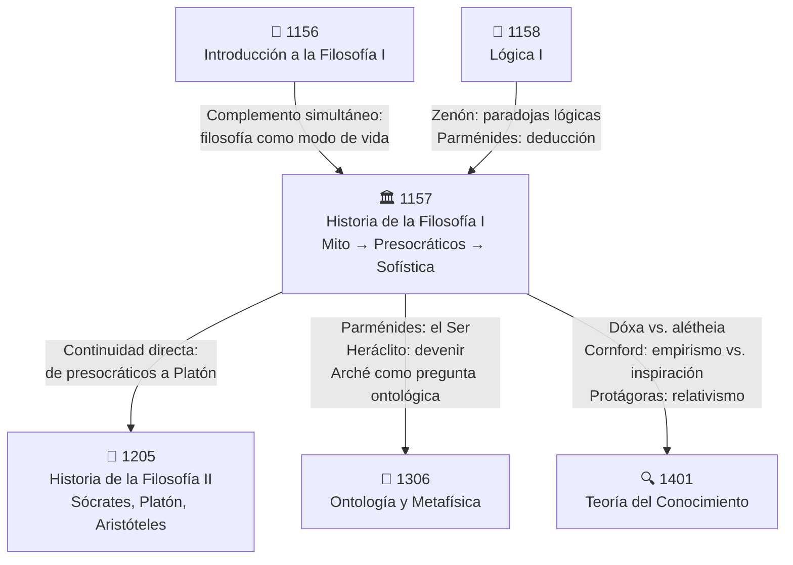

# 🏛️ Historia de la Filosofía I

## *Del Mito al Logos: los pensadores del período arcaico y presocrático*

---

> *«Φύσις κρύπτεσθαι φιλεῖ» — La naturaleza ama ocultarse.*
> — **[[Heráclito]] de Éfeso**, fr. DK 22 B 123

> *«Χρὴ τὸ λέγειν τε νοεῖν τ' ἐὸν ἔμμεναι» — Es necesario decir y pensar que lo que es, es.*
> — **[[Parménides]] de Elea**, fr. DK 28 B 6

---

## 📋 Ficha de Identificación

| Campo | Detalle |
|:---|:---|
| **Clave** | `1157` |
| **Asignatura** | Historia de la Filosofía I |
| **Subtítulo** | Del mito al logos: contexto, presocráticos y sofística |
| **Semestre** | 1.º — *Fundamentos* |
| **Sistema** | SUAyED — UNAM |
| **Carácter** | Obligatoria |
| **Créditos** | 8 |
| **Horas semanales** | 3 |
| **Área** | Historia de la Filosofía |
| **Prerrequisitos** | Ninguno |
| **Profesor de referencia** | López Espinoza, Marco Antonio |
| **Período sugerido** | Semestre 1 del plan de estudios |
| **Modalidad MDP** | 📖 Inmersión temática · Ciclo de 14 días · 40 horas |

---

## 🏛️ Descripción General del Curso

La **Historia de la Filosofía I** no es un recorrido panorámico por toda la Antigüedad griega: es una **inmersión concentrada** en el momento más decisivo de la historia intelectual de Occidente — el nacimiento mismo de la filosofía. El curso se centra exclusivamente en los **pensadores presocráticos**, desde el contexto mitológico-religioso que los precedió hasta la transformación sofística que preparó el terreno para [[Sócrates]] y [[Platón]].

El temario, diseñado por el Prof. López Espinoza, **problematiza la narrativa tradicional** que presenta a [[Tales de Mileto]] como «el primer filósofo» sin más. En lugar de aceptar acríticamente la interpretación aristotélica como único filtro para leer a los presocráticos, el curso invita a reconsiderar las fuentes, a situar a cada pensador en su propio horizonte histórico y a descubrir los hilos que conectan [[Mythos|mito]] y [[Logos|razón]] de maneras más complejas que una simple «ruptura».

El arco temático va del culto y la fiesta griega ([[Kerényi]]), pasando por la revisión crítica del esquema doxográfico ([[Gadamer]], [[Cornford]]), hasta los pensadores de Mileto, Éfeso, Elea, y los pluralistas y atomistas del siglo V a.C. El recorrido culmina con el [[Orfismo]], el [[Pitagorismo]] y la [[Sofística]] — las tradiciones que transformaron el concepto de *psyché* y construyeron el suelo histórico sobre el que Platón y Aristóteles edificarán sus sistemas.

> [!IMPORTANT]
> Este curso **NO** cubre a Platón, Aristóteles ni las escuelas helenísticas. Esos temas corresponden a [[1205 - Historia de la Filosofía II-1]]. El enfoque aquí es **exclusivamente presocrático**.

---

## 🎯 Objetivos de Aprendizaje

Al concluir esta asignatura, el estudiante será capaz de:

1. 🔗 **Encontrar vínculos y diferencias** entre la tradición mitológica griega y el pensamiento filosófico antiguo
2. 🔍 **Conocer y reflexionar** sobre los pensadores representativos del período arcaico
3. 🏗️ **Identificar las tradiciones** que preceden y sustentan el pensamiento clásico (Platón/Aristóteles)
4. 📜 **Evaluar críticamente** la interpretación aristotélica como base única para entender el origen de la filosofía
5. ⚖️ **Distinguir entre presupuestos** científicos y filosóficos de origen griego
6. 🌊 **Analizar los fragmentos presocráticos** con independencia del esquema aristotélico, situándolos en su propio contexto histórico

---

## 📜 Integración con el [[Manifiesto]]

> [!NOTE]
> ### 🔱 Los Cuatro Pilares del Estudio MDP
>
> | Pilar | Aplicación en esta materia |
> |:---|:---|
> | **🧠 Ultralearning** | Inmersión intensiva de 14 días · 40 hrs totales · reconocimiento → bisturí → confrontación |
> | **🃏 Active Recall / Anki** | Tarjetas sobre fragmentos presocráticos, conceptos griegos, atribuciones doxográficas |
> | **🗣️ Técnica Feynman** | Explicar cada pensador como si enseñaras a alguien que nunca oyó hablar de filosofía |
> | **⚔️ Pares Dialécticos** | [[Heráclito]] vs. [[Parménides]] · [[Mythos]] vs. [[Logos]] · [[Physis]] vs. *Nomos* · Empirismo vs. Inspiración |
>
> ---
>
> **📏 Las 5 Reglas de Oro:**
> 1. No avanzar sin dominar la unidad anterior
> 2. Cada sesión produce al menos una tarjeta Anki
> 3. Feynman antes de dormir — reformular lo aprendido sin notas
> 4. Cada unidad culmina en un par dialéctico escrito
> 5. Auditoría mensual: revisar tarjetas, lagunas, recalibrar

---

## 📊 Protocolo MDP — Ciclo de 14 Días

> [!TIP]
> El protocolo organiza **40 horas** en un ciclo de 14 días distribuidos en tres fases. Marca tu avance con ✅ conforme completes cada bloque.

### Fase A · 🔭 Reconocimiento (Días 1–7)

| Día | Horas | Actividad | Estado |
|:---:|:---:|:---|:---:|
| 1 | 3 | Lectura panorámica del temario completo · Mapear las 5 unidades · Identificar conceptos nuevos | ⬜ |
| 2 | 3 | Unidad I: Leer Kerényi, «Qué es la mitología» y «La esencia de la fiesta» (pp. 13-26; 37-52) | ⬜ |
| 3 | 3 | Unidad II: Leer Gadamer, «El planteamiento doxográfico de Aristóteles» (pp. 85-97) | ⬜ |
| 4 | 3 | Unidad II: Leer Cornford, «Empirismo versus inspiración» y «La teoría empírica del conocimiento» (pp. 17-26; 48-63) | ⬜ |
| 5 | 3 | Unidad III: Eggers et al., *Los filósofos presocráticos I*, pp. 55-143 (milesios y Jenófanes) | ⬜ |
| 6 | 3 | Unidad III: Eggers et al., *Los filósofos presocráticos I*, pp. 265-483 ([[Heráclito]] y [[Parménides]]) | ⬜ |
| 7 | 2 | Síntesis de reconocimiento: primer mapa conceptual global · Primeras tarjetas Anki · Preguntas abiertas | ⬜ |

### Fase B · 🔬 Lectura con Bisturí (Días 8–12)

| Día | Horas | Actividad | Estado |
|:---:|:---:|:---|:---:|
| 8 | 3 | Unidad IV: Eggers, *Presocráticos II y III* — Zenón, Meliso, [[Empédocles]] | ⬜ |
| 9 | 3 | Unidad IV: Anaxágoras, Diógenes de Apolonia, Leucipo, [[Demócrito]] | ⬜ |
| 10 | 3 | Unidad V: Bernabé pp. 69-87 ([[Orfismo]]) + Eggers I y III ([[Pitagorismo]]) | ⬜ |
| 11 | 3 | Unidad V: Jaeger, *Paideia* pp. 281-302 ([[Sofística]]: Protágoras, Gorgias) + Guthrie, *Orfeo y la religión griega* | ⬜ |
| 12 | 2 | Lectura de apoyo: Bernabé, *De Tales a Demócrito* · Consolidar tarjetas Anki · Feynman oral | ⬜ |

### Fase C · ⚔️ Confrontación Dialéctica + Ensayo (Días 13–14)

| Día | Horas | Actividad | Estado |
|:---:|:---:|:---|:---:|
| 13 | 3 | Confrontación dialéctica: construir pares ([[Heráclito]]-[[Parménides]], [[Mythos]]-[[Logos]], *physis*-*nomos*) · Esquema del ensayo | ⬜ |
| 14 | 3 | Redacción del ensayo (1000-1500 palabras) · Defensa dialéctica imaginada · Bitácora final | ⬜ |

---

## 📚 Temario Detallado

---

### Unidad I · 🏺 Contexto y Antecedentes Mitológicos

> *«Antes del logos estuvo el mito, y en el mito ya latía la pregunta.»*

**Pregunta rectora:** *¿Cuál es la relación entre la tradición mitológica griega y el surgimiento del pensamiento filosófico? ¿Continuidad, ruptura, o transformación?*

- [ ] **1.1 El contexto mítico de la civilización griega**
  - La función del mito: explicación, orientación, sentido comunitario
  - Culto, fiesta y religión en la Grecia arcaica
  - La relación entre mitología y religión según [[Kerényi]]
- [ ] **1.2 La esencia de la fiesta y el sentido del culto**
  - Lo sagrado como experiencia fundante
  - El festival como ruptura del tiempo cotidiano
  - Mito vivido vs. mito narrado
- [ ] **1.3 Mito y religión en la Grecia antigua**
  - [[Vernant]]: el politeísmo como sistema de pensamiento
  - La distancia entre religión griega y monoteísmos posteriores
  - Los dioses como potencias, no como personas morales

> [!NOTE]
> Esta unidad **no** estudia aún a filósofos. Su función es establecer el *horizonte previo* desde el cual la filosofía emerge. Sin entender el mito, la ruptura filosófica queda incomprensible.

**📖 Bibliografía de la unidad:**

| Tipo | Obra | Autor | Editorial / Año | Páginas |
|:---:|:---|:---|:---|:---|
| 📕 Base | *La Religión Antigua* | Kerényi, Karl | Herder, 1999 | «Qué es la mitología» y «La esencia de la fiesta», pp. 13-26; 37-52 |
| 📕 Base | *Mito y religión en la Grecia antigua* | Vernant, Jean-Pierre | Ariel, 2001 | Completo |
| 📗 Apoyo | *Diccionario de Mitología Griega y Romana* | Grimal, Pierre | Paidós | Consulta |
| 📗 Apoyo | *La sabiduría griega I* | Colli, Giorgio | Trotta | pp. 30-34; 98-112 |

---

### Unidad II · 🔍 Introducción a la Filosofía Antigua

> *«No se trata de saber qué dijeron los presocráticos según Aristóteles, sino qué dijeron ellos mismos en su propio contexto.»*

**Pregunta rectora:** *¿Es legítimo leer a los presocráticos exclusivamente a través del filtro aristotélico? ¿Qué se pierde con la [[Doxografía]] tradicional?*

- [ ] **2.1 Revisión crítica de la interpretación aristotélica**
  - El planteamiento doxográfico de [[Aristóteles]]: los presocráticos como «buscadores de causas»
  - [[Gadamer]]: límites y distorsiones de ese esquema
  - ¿Tenían los presocráticos un concepto de «causa» en sentido aristotélico?
- [ ] **2.2 Presupuestos metodológicos**
  - Distinción entre presupuestos científicos y filosóficos de origen griego
  - Empirismo vs. inspiración ([[Cornford]])
  - La teoría empírica del conocimiento como modelo retrospectivo
- [ ] **2.3 La condición histórica del pensamiento antiguo**
  - Todo pensamiento antiguo es situado: contexto político, social, material
  - La filosofía no nace en el vacío: colonias jonias, comercio, escritura
  - El problema de las fuentes: fragmentos, testimonios, doxografía

> [!WARNING]
> La trampa más común al estudiar a los presocráticos es leerlos *como si fueran científicos fallidos* o *como precursores imperfectos de Aristóteles*. Esta unidad te vacuna contra esa lectura anacrónica.

**📖 Bibliografía de la unidad:**

| Tipo | Obra | Autor | Editorial / Año | Páginas |
|:---:|:---|:---|:---|:---|
| 📕 Base | *El inicio de la filosofía occidental* | Gadamer, Hans-Georg | Paidós | «El planteamiento doxográfico de Aristóteles», pp. 85-97 |
| 📕 Base | *Principium sapientiae* | Cornford, F. M. | Visor | «Empirismo vs. inspiración» y «La teoría empírica del conocimiento», pp. 17-26; 48-63 |
| 📗 Apoyo | *La crítica aristotélica a la filosofía presocrática* | Cherniss, Harold | UNAM, 1981 | Completo |

---

### Unidad III · 🌊 Los Presocráticos I (Siglo VI a.C.)

> *«Este cosmos, el mismo para todos, no lo hizo ninguno de los dioses ni de los hombres, sino que fue siempre, es y será fuego siempre vivo, que se enciende según medidas y se apaga según medidas.»*
> — **[[Heráclito]]**, fr. DK 22 B 30

**Pregunta rectora:** *¿Cuál es el principio ([[Arché]]) constitutivo de todas las cosas? ¿Cómo piensan estos autores la [[Physis]] con independencia de la teleología aristotélica?*

- [ ] **3.1 La escuela de Mileto**
  - **[[Tales de Mileto]]** (c. 624–546 a.C.): el agua como [[Arché]]; «todo está lleno de dioses»
  - **[[Anaximandro]]** (c. 610–546 a.C.): el *ápeiron* (lo ilimitado); la justicia cósmica; primer mapa
  - **Anaxímenes** (c. 585–528 a.C.): el aire; condensación y rarefacción como mecanismo
- [ ] **3.2 Jenófanes de Colofón**
  - Crítica al antropomorfismo religioso
  - «Si los bueyes tuvieran dioses, los pintarían como bueyes»
  - ¿Proto-monoteísmo o crítica epistemológica?
- [ ] **3.3 [[Heráclito]] de Éfeso (c. 535–475 a.C.)**
  - El fuego como [[Arché]] dinámico
  - El [[Logos]] como ley universal: «escuchando no a mí sino al [[Logos]]»
  - La doctrina del flujo (*panta rhei*) y la unidad de los contrarios
  - El estilo oracular: ¿oscuridad deliberada o profundidad del pensamiento?
- [ ] **3.4 [[Parménides]] de Elea (c. 515–450 a.C.)**
  - El poema *Sobre la naturaleza*: proemio, vía de la verdad, vía de la opinión
  - El Ser es, el no-ser no es: unicidad, inmutabilidad, eternidad, continuidad
  - La diosa y la revelación: ¿razón o inspiración?
  - El desafío radical: ¿cómo es posible el cambio si el ser es uno e inmóvil?

> [!IMPORTANT]
> Los textos de esta unidad se estudian **con independencia del esquema aristotélico**, situados en su propio contexto histórico (siglo VI a.C.). La edición de referencia es Eggers et al., *Los filósofos presocráticos I* (Gredos).

**📖 Bibliografía de la unidad:**

| Tipo | Obra | Autor | Editorial / Año | Páginas |
|:---:|:---|:---|:---|:---|
| 📕 Base | *Los filósofos presocráticos I* | Eggers, C. et al. | Gredos (BCG) | pp. 55-143 (milesios, Jenófanes); pp. 265-483 (Heráclito, Parménides) |
| 📗 Apoyo | *De Tales a Demócrito* | Bernabé, Alberto | Alianza | Secciones correspondientes |
| 📗 Apoyo | *El inicio de la filosofía occidental* | Gadamer, H.-G. | Paidós | Caps. sobre Heráclito y Parménides |
| 📗 Apoyo | *Historia de la filosofía griega*, vols. I y II | Guthrie, W. K. C. | Gredos | Secciones correspondientes |

---

### Unidad IV · ⚛️ Los Presocráticos II (Siglo V a.C.)

> *«Nada nace ni perece, sino que a partir de cosas que son se produce mezcla y separación.»*
> — **[[Empédocles]]**, fr. DK 31 B 8

**Pregunta rectora:** *¿Cómo responden los pensadores del siglo V al desafío de [[Parménides]]? ¿Es posible salvar las apariencias sin negar la razón?*

- [ ] **4.1 La defensa y radicalización del eleatismo**
  - **Zenón de Elea**: las paradojas del movimiento (Aquiles, la flecha, el estadio)
  - **Meliso de Samos**: el ser como infinito en extensión y tiempo
- [ ] **4.2 Los pluralistas**
  - **[[Empédocles]]** (c. 492–432 a.C.): los cuatro elementos (*rizómata*); Amor (*Philía*) y Discordia (*Neîkos*); el ciclo cósmico
  - **Anaxágoras** (c. 500–428 a.C.): las *homeomerías* (semillas); el *Noûs* como principio ordenador
- [ ] **4.3 Los últimos physiólogos**
  - **Diógenes de Apolonia**: retorno al aire como principio inteligente
  - El eclecticismo como síntoma de madurez del programa presocrático
- [ ] **4.4 El atomismo**
  - **Leucipo** y **[[Demócrito]]** (c. 460–370 a.C.): átomos y vacío
  - Mecanicismo, necesidad (*anánke*) y el azar
  - La respuesta más radical a Parménides: el no-ser (vacío) *sí* existe

> [!TIP]
> Observa cómo cada pensador del siglo V está *respondiendo* a Parménides. Incluso quienes lo rechazan aceptan sus reglas de juego: ya no basta con postular un [[Arché]] — hay que argumentar lógicamente por qué el cambio es posible.

**📖 Bibliografía de la unidad:**

| Tipo | Obra | Autor | Editorial / Año | Páginas |
|:---:|:---|:---|:---|:---|
| 📕 Base | *Los filósofos presocráticos II y III* | Eggers, C. et al. | Gredos (BCG) | Secciones de Zenón, Meliso, Empédocles, Anaxágoras, Leucipo, Demócrito |
| 📗 Apoyo | *De Tales a Demócrito* | Bernabé, Alberto | Alianza | Secciones correspondientes |
| 📗 Apoyo | *La sabiduría griega I* | Colli, Giorgio | Trotta | Secciones sobre Zenón |
| 📗 Apoyo | *Historia de la filosofía griega*, vol. II | Guthrie, W. K. C. | Gredos | Secciones correspondientes |

---

### Unidad V · 🔮 Presocráticos III: Orfismo, Pitagorismo y Sofística

> *«El hombre es la medida de todas las cosas, de las que son en cuanto son y de las que no son en cuanto no son.»*
> — **Protágoras**, fr. DK 80 B 1

**Pregunta rectora:** *¿Cómo se transforma el concepto de *psyché* desde las tradiciones místico-religiosas hasta la sofística? ¿Qué suelo histórico preparan estas corrientes para Sócrates y Platón?*

- [ ] **5.1 [[Orfismo]]**
  - El mito de Orfeo y Eurídice: descenso, canto, pérdida
  - La doctrina órfica del alma: inmortalidad, transmigración, purificación
  - *Sôma-sêma*: el cuerpo como tumba/prisión del alma
  - Las laminillas de oro y los textos rituales
- [ ] **5.2 [[Pitagorismo]]**
  - Pitágoras como figura entre el mito y la historia
  - El número como principio: armonía, proporción, cosmos
  - La *tetractys* y la música de las esferas
  - La comunidad pitagórica: reglas de vida, ascetismo, secreto
  - La transformación del concepto de *psyché*: del aliento vital al alma racional
- [ ] **5.3 [[Sofística]]**
  - **Protágoras de Abdera** (c. 490–420 a.C.): la tesis del *homo mensura*; relativismo; agnosticismo sobre los dioses
  - **Gorgias de Leontinos** (c. 485–380 a.C.): *Sobre el no-ser*; la retórica como *dynamis*; el lenguaje como «fármaco»
  - *Nomos* vs. *physis*: ¿la justicia es natural o convencional?
  - Los sofistas como educadores: la *paideia* democrática

> [!IMPORTANT]
> Estas tres tradiciones —[[Orfismo]], [[Pitagorismo]], [[Sofística]]— constituyen el **suelo histórico** sobre el que se levantarán Sócrates y Platón. Sin orfismo, no hay inmortalidad del alma platónica; sin pitagorismo, no hay matematización del cosmos; sin sofística, no hay dialéctica socrática.

**📖 Bibliografía de la unidad:**

| Tipo | Obra | Autor | Editorial / Año | Páginas |
|:---:|:---|:---|:---|:---|
| 📕 Base | *De Tales a Demócrito* | Bernabé, Alberto | Alianza | pp. 69-87 |
| 📕 Base | *Los filósofos presocráticos I y III* | Eggers, C. et al. | Gredos (BCG) | Secciones sobre pitagóricos y sofistas |
| 📕 Base | *Paideia* | Jaeger, Werner | FCE | pp. 281-302 |
| 📗 Apoyo | *Orfeo y la religión griega* | Guthrie, W. K. C. | Siruela | Completo |

---

## ⏳ Línea de Tiempo: Del Mito a la Sofística

```mermaid
flowchart LR
    subgraph M["🏺 Tradición Mítica"]
        HOM["Homero\nc. s. VIII a.C."]
        HES["Hesíodo\nc. s. VII a.C."]
        ORF["Tradición Órfica\nc. s. VII-VI a.C."]
    end

    subgraph S1["🌊 Siglo VI a.C. — Presocráticos I"]
        T["Tales\nc. 624"]
        AX["Anaximandro\nc. 610"]
        AN["Anaxímenes\nc. 585"]
        PIT["Pitágoras\nc. 570"]
        JEN["Jenófanes\nc. 570"]
    end

    subgraph S2["🔥 Siglos VI-V a.C."]
        HER["Heráclito\nc. 535"]
        PAR["Parménides\nc. 515"]
    end

    subgraph S3["⚛️ Siglo V a.C. — Presocráticos II"]
        ZEN["Zenón\nc. 490"]
        EMP["Empédocles\nc. 492"]
        ANG["Anaxágoras\nc. 500"]
        LEU["Leucipo\nc. 460"]
        DEM["Demócrito\nc. 460"]
    end

    subgraph S4["🗣️ Siglo V a.C. — Sofística"]
        PRO["Protágoras\nc. 490"]
        GOR["Gorgias\nc. 485"]
    end

    subgraph FUT["➡️ Lo que viene después"]
        SOC["Sócrates\n470-399"]
        PLA["Platón\n428-348"]
    end

    M --> S1 --> S2 --> S3 --> S4 -.->|"Este curso\ntermina aquí"| FUT
```



---

## 🗺️ Mapa Conceptual: Problemas Fundamentales de los Presocráticos

```mermaid
flowchart TB
    CENTER(("🏛️ PROBLEMAS\nDEL PERÍODO\nPRESOCRÁTICO"))

    ARCHE["🌊 ¿Cuál es el ARCHÉ?\nEl principio de todas las cosas"]
    CAMBIO["⚡ CAMBIO vs. PERMANENCIA\n¿El ser fluye o es inmóvil?"]
    MYTLOG["🔮 MYTHOS vs. LOGOS\n¿Ruptura o continuidad?"]
    PHYSIS["🌿 ¿Qué es la PHYSIS?\nNaturaleza como proceso"]
    PSYCHE["👁️ LA PSYCHÉ\nDel aliento vital al alma racional"]
    NOMOS["⚖️ NOMOS vs. PHYSIS\n¿Convención o naturaleza?"]

    CENTER --- ARCHE
    CENTER --- CAMBIO
    CENTER --- MYTLOG
    CENTER --- PHYSIS
    CENTER --- PSYCHE
    CENTER --- NOMOS

    ARCHE -.- T1["Tales: agua"]
    ARCHE -.- T2["Anaximandro: ápeiron"]
    ARCHE -.- T3["Anaxímenes: aire"]
    ARCHE -.- T4["Heráclito: fuego/logos"]
    ARCHE -.- T5["Demócrito: átomos"]
    ARCHE -.- T6["Pitágoras: número"]

    CAMBIO -.- C1["Heráclito: todo fluye"]
    CAMBIO -.- C2["Parménides: el ser es inmóvil"]
    CAMBIO -.- C3["Empédocles: mezcla y separación"]
    CAMBIO -.- C4["Atomistas: átomos en movimiento en el vacío"]

    MYTLOG -.- M1["Kerényi: el mito como experiencia"]
    MYTLOG -.- M2["Vernant: politeísmo como sistema"]
    MYTLOG -.- M3["Cornford: del ritual al concepto"]

    PSYCHE -.- P1["Orfismo: alma inmortal, cuerpo-tumba"]
    PSYCHE -.- P2["Pitagorismo: alma racional, transmigración"]
    PSYCHE -.- P3["Sofística: alma como sujeto de persuasión"]

    NOMOS -.- N1["Protágoras: homo mensura"]
    NOMOS -.- N2["Gorgias: poder del lenguaje"]
```



---

## 📖 Bibliografía General Consolidada

### Textos Base (obligatorios según el LEMA)

| # | Obra | Autor | Editorial | Unidad(es) |
|:---:|:---|:---|:---|:---:|
| 1 | *La Religión Antigua* | Kerényi, Karl | Herder, 1999 | I |
| 2 | *Mito y religión en la Grecia antigua* | Vernant, Jean-Pierre | Ariel, 2001 | I |
| 3 | *El inicio de la filosofía occidental* | Gadamer, Hans-Georg | Paidós | II, III |
| 4 | *Principium sapientiae* | Cornford, F. M. | Visor | II |
| 5 | *Los filósofos presocráticos I* | Eggers, C. et al. | Gredos (BCG) | III, V |
| 6 | *Los filósofos presocráticos II* | Eggers, C. et al. | Gredos (BCG) | IV |
| 7 | *Los filósofos presocráticos III* | Eggers, C. et al. | Gredos (BCG) | IV, V |
| 8 | *De Tales a Demócrito* | Bernabé, Alberto | Alianza | III, IV, V |
| 9 | *Paideia* | Jaeger, Werner | FCE | V |

### Textos de Apoyo y Consulta

| # | Obra | Autor | Editorial | Uso |
|:---:|:---|:---|:---|:---|
| 10 | *Diccionario de Mitología Griega y Romana* | Grimal, Pierre | Paidós | Consulta general U1 |
| 11 | *La sabiduría griega I* | Colli, Giorgio | Trotta | Apoyo U1, U4 |
| 12 | *La crítica aristotélica a la filosofía presocrática* | Cherniss, Harold | UNAM, 1981 | Apoyo U2 |
| 13 | *Historia de la filosofía griega*, vols. I-II | Guthrie, W. K. C. | Gredos | Referencia general |
| 14 | *Orfeo y la religión griega* | Guthrie, W. K. C. | Siruela | Apoyo U5 |

> [!TIP]
> Las ediciones de la **Biblioteca Clásica Gredos (BCG)** son la referencia estándar. Muchas están disponibles digitalmente a través de [BIDI-UNAM](https://bidi.unam.mx/). Los tres tomos de Eggers (*Presocráticos I, II, III*) son el **texto eje** de todo el curso.

---

## 📝 Vocabulario Filosófico Esencial

> *«Los límites de mi lenguaje son los límites de mi mundo.»* — Wittgenstein

| # | Griego | Transliteración | Definición | Pensador(es) clave |
|:---:|:---|:---|:---|:---|
| 1 | **ἀρχή** | *[[Arché]]* | Principio, origen, fundamento primero de todas las cosas | Tales, Anaximandro, todos |
| 2 | **λόγος** | *[[Logos]]* | Razón, palabra, ley cósmica, proporción | [[Heráclito]] |
| 3 | **φύσις** | *[[Physis]]* | Naturaleza; el proceso de surgimiento y crecimiento | Todos los presocráticos |
| 4 | **μῦθος** | *[[Mythos]]* | Relato, narración, palabra sagrada; la explicación pre-racional | Tradición mítica |
| 5 | **ἄπειρον** | *ápeiron* | Lo ilimitado, indeterminado, infinito | [[Anaximandro]] |
| 6 | **νοῦς** | *noûs* | Mente, intelecto; principio ordenador | Anaxágoras |
| 7 | **ἄτομον** | *átomon* | Lo indivisible; partícula última de materia | Leucipo, [[Demócrito]] |
| 8 | **κένον** | *kenón* | El vacío; el no-ser como condición del movimiento | Leucipo, [[Demócrito]] |
| 9 | **ψυχή** | *psyché* | Alma, principio vital; se transforma de aliento a razón | [[Orfismo]], [[Pitagorismo]] |
| 10 | **ἁρμονία** | *harmonía* | Armonía, proporción, ajuste de contrarios | Pitágoras, [[Heráclito]] |
| 11 | **νόμος** | *nómos* | Ley, convención, costumbre; lo establecido por acuerdo | [[Sofística]] |
| 12 | **δόξα** | *dóxa* | Opinión, apariencia; vía de error según [[Parménides]] | [[Parménides]] |
| 13 | **ἀλήθεια** | *alétheia* | Verdad; lit. «des-ocultamiento» | [[Parménides]] |
| 14 | **ῥιζώματα** | *rizómata* | Raíces; los cuatro elementos de [[Empédocles]] | [[Empédocles]] |
| 15 | **ἀνάγκη** | *anánke* | Necesidad; fuerza cósmica ineludible | [[Demócrito]], [[Parménides]] |
| 16 | **δοξογραφία** | *[[Doxografía]]* | Recopilación de «opiniones» de los filósofos | Tradición aristotélica |
| 17 | **πάντα ῥεῖ** | *pánta rheî* | «Todo fluye»; doctrina del cambio perpetuo | [[Heráclito]] |
| 18 | **τὸ ὄν** | *tò ón* | El ser, lo que es | [[Parménides]] |

---

## 🃏 Tarjetas Anki Sugeridas

> [!TIP]
> Crea estas tarjetas durante las primeras fases. El *active recall* diario es el pilar más poderoso para retener la complejidad de los fragmentos presocráticos.

| # | Frente (pregunta) | Reverso (respuesta) |
|:---:|:---|:---|
| 1 | ¿Cuál es el *arché* según Tales de Mileto? | El agua (ὕδωρ). Todo proviene del agua y retorna a ella. |
| 2 | ¿Qué significa *ápeiron* y quién lo propuso? | Lo ilimitado/indeterminado. Anaximandro. Es el principio del que surgen y al que retornan todas las cosas determinadas. |
| 3 | ¿Cuál es el mecanismo cósmico de Anaxímenes? | Condensación y rarefacción del aire: al condensarse se vuelve agua, tierra; al enrarecerse se vuelve fuego. |
| 4 | ¿Qué significa «Φύσις κρύπτεσθαι φιλεῖ»? | «La naturaleza ama ocultarse.» — Heráclito, fr. B 123. La realidad profunda no se muestra a primera vista. |
| 5 | ¿Cuáles son las dos vías del poema de Parménides? | La vía de la verdad (el Ser es, el no-ser no es) y la vía de la opinión (el mundo aparente de los mortales). |
| 6 | ¿Qué son los *rizómata* de Empédocles? | Las cuatro «raíces»: tierra, agua, aire y fuego. Nada nace ni perece; solo hay mezcla y separación. |
| 7 | ¿Cómo resuelven los atomistas el desafío de Parménides? | Aceptan el no-ser (vacío/kenón) como existente, lo que permite el movimiento de los átomos indivisibles. |
| 8 | ¿Qué es la doxografía y por qué es problemática? | Recopilación de «opiniones» de filósofos hecha por autores posteriores (esp. aristotélicos). Es problemática porque impone categorías ajenas a los pensadores originales. |
| 9 | ¿Qué significa *sôma-sêma* en la tradición órfica? | «El cuerpo es tumba del alma.» El alma está prisionera en el cuerpo y busca purificarse para liberarse. |
| 10 | ¿Cuál es la tesis del *homo mensura* de Protágoras? | «El hombre es la medida de todas las cosas»: lo que parece verdadero a cada quien, es verdadero para esa persona. |

---

## 🏆 Artefacto Final: Ensayo Dialéctico

> [!CAUTION]
> ### Evaluación del ciclo MDP
>
> **Formato:** Ensayo de **1000-1500 palabras**
> **Estructura:** Tesis → Antítesis → Síntesis → Defensa dialéctica
> **Entrega:** Día 14 del ciclo
>
> **Pares dialécticos sugeridos para el ensayo:**
>
> | Par | Tesis | Antítesis |
> |:---:|:---|:---|
> | A | [[Heráclito]]: todo fluye, la realidad es cambio perpetuo | [[Parménides]]: el ser es uno e inmóvil, el cambio es ilusión |
> | B | [[Mythos]]: el mito explica el mundo mediante narración sagrada | [[Logos]]: la razón busca principios universales sin recurrir a dioses |
> | C | Cornford: la filosofía nace del ritual, hay continuidad mito→logos | Burnet: la filosofía es ruptura radical con el pensamiento mítico |
> | D | Protágoras: la verdad es relativa al sujeto (*homo mensura*) | [[Parménides]]: hay una verdad absoluta del Ser, independiente del sujeto |
> | E | Aristotélicos: los presocráticos buscaban causas materiales | [[Gadamer]]/Cherniss: esa lectura distorsiona a los presocráticos |

---

## 🔗 Conexiones Curriculares



| Asignatura | Clave | Conexión principal |
|:---|:---:|:---|
| [[1156 - Introducción a la Filosofía I]] | `1156` | Complemento simultáneo: la introducción ofrece el marco general; esta materia lo concreta históricamente |
| [[1158 - Lógica I]] | `1158` | Las paradojas de Zenón y la deducción parmenídea son proto-lógica; el [[Logos]] heraclíteo prefigura la razón formal |
| [[1205 - Historia de la Filosofía II-1]] | `1205` | Continuidad directa: Platón y Aristóteles *responden* a los presocráticos; esta materia es su prerrequisito conceptual |
| Ontología y Metafísica | `1306` | [[Parménides]] funda la ontología; la pregunta por el [[Arché]] es la primera pregunta metafísica |
| Teoría del Conocimiento | `1401` | La distinción *dóxa/alétheia* de [[Parménides]], el debate empirismo/inspiración de [[Cornford]], y el relativismo sofístico son matrices epistemológicas |

---

## 📓 Bitácora por Fase

### Fase A · 🔭 Reconocimiento (Días 1–7)

```
📝 RECONOCIMIENTO — Notas libres
──────────────────────────────────────────
Fecha de inicio: ___/___/______

Primeras impresiones del temario:


Conceptos nuevos que necesito investigar:


¿Qué esperaba encontrar en este curso y qué me sorprendió?


Primer mapa conceptual (descripción o referencia a archivo):


Tarjetas Anki creadas en esta fase: ___ / meta: 15
```

---

### Fase B · 🔬 Lectura con Bisturí (Días 8–12)

```
📝 LECTURA CON BISTURÍ — Registro
──────────────────────────────────────────
Texto leído: _________________________________
Autor: _______________________________________
Fecha de lectura: ___/___/______

Tesis principal del texto:


Fragmentos presocráticos clave identificados:


Pasajes difíciles / oscuros:


¿Cómo cambia mi lectura al NO usar el filtro aristotélico?


Tarjetas Anki creadas en esta fase: ___ / meta: 15
```

---

### Fase C · ⚔️ Confrontación Dialéctica (Días 13–14)

```
📝 CONFRONTACIÓN DIALÉCTICA — Ensayo
──────────────────────────────────────────
Par dialéctico elegido: _____________________
Fecha: ___/___/______

TESIS (posición A):


ANTÍTESIS (posición B):


MI SÍNTESIS:


Fortalezas de mi argumento:


Debilidades reconocidas:


Palabras del ensayo: ____ / meta: 1000-1500
```

---

## ❓ Preguntas No Resueltas

> *Espacio para registrar preguntas que surjan durante el estudio y que no encuentren respuesta inmediata. Estas preguntas son valiosas — son la materia prima de la investigación filosófica.*

| # | Pregunta | Unidad | Fecha | ¿Resuelta? |
|:---:|:---|:---:|:---:|:---:|
| 1 | ¿Tenían los presocráticos consciencia de estar haciendo algo *distinto* del mito? | I-II | | ⬜ |
| 2 | ¿El fragmento B30 de Heráclito habla del cosmos físico o del cosmos como orden racional? | III | | ⬜ |
| 3 | ¿Cómo sabemos que Parménides no era simplemente un místico que recibió una revelación? | III | | ⬜ |
| 4 | ¿Es el atomismo de Demócrito verdaderamente materialista en sentido moderno? | IV | | ⬜ |
| 5 | ¿Hasta qué punto el pitagorismo es filosofía y hasta qué punto es religión? | V | | ⬜ |
| 6 | | | | ⬜ |
| 7 | | | | ⬜ |
| 8 | | | | ⬜ |

---

## 📔 Diario Filosófico

> *«Escuchando no a mí sino al Logos, es sabio convenir en que todas las cosas son una.»*
> — **[[Heráclito]]**, fr. DK 22 B 50

```
📔 DIARIO FILOSÓFICO — Historia de la Filosofía I
──────────────────────────────────────────

Entrada 1 · Fecha: ___/___/______
¿Qué idea me impactó hoy? ¿Por qué?


Entrada 2 · Fecha: ___/___/______
¿Algo que leí hoy cambió mi forma de ver el mundo?


Entrada 3 · Fecha: ___/___/______
Si pudiera conversar con un presocrático, ¿quién sería y qué le preguntaría?


```

---

> [!NOTE]
> ### 🔄 Auditoría Mensual
> Al final de cada mes, revisa:
> - [ ] ¿Cuántas tarjetas Anki tengo activas? ¿Las repaso diario?
> - [ ] ¿Completé las tres fases del ciclo MDP?
> - [ ] ¿Escribí el ensayo dialéctico? ¿Tiene tesis, antítesis y síntesis?
> - [ ] ¿Puedo explicar a un no-filósofo qué pensaban los presocráticos? (Feynman test)
> - [ ] ¿Qué lagunas detecté? ¿Cuál es mi plan para cubrirlas?

---

<div align="center">

*🏛️ «ἓν τὸ σοφόν» — Una sola cosa es lo sabio.*
— [[Heráclito]], fr. DK 22 B 32

**Historia de la Filosofía I · LEMA 1157 · SUAyED-UNAM**
**Protocolo MDP · 14 días · 40 horas**

</div>
