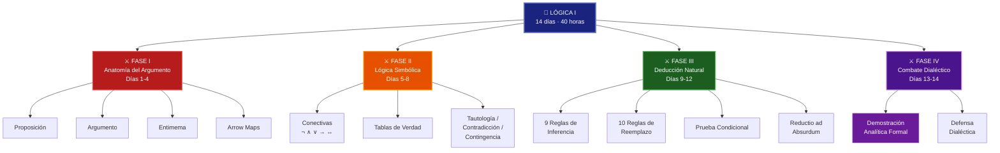
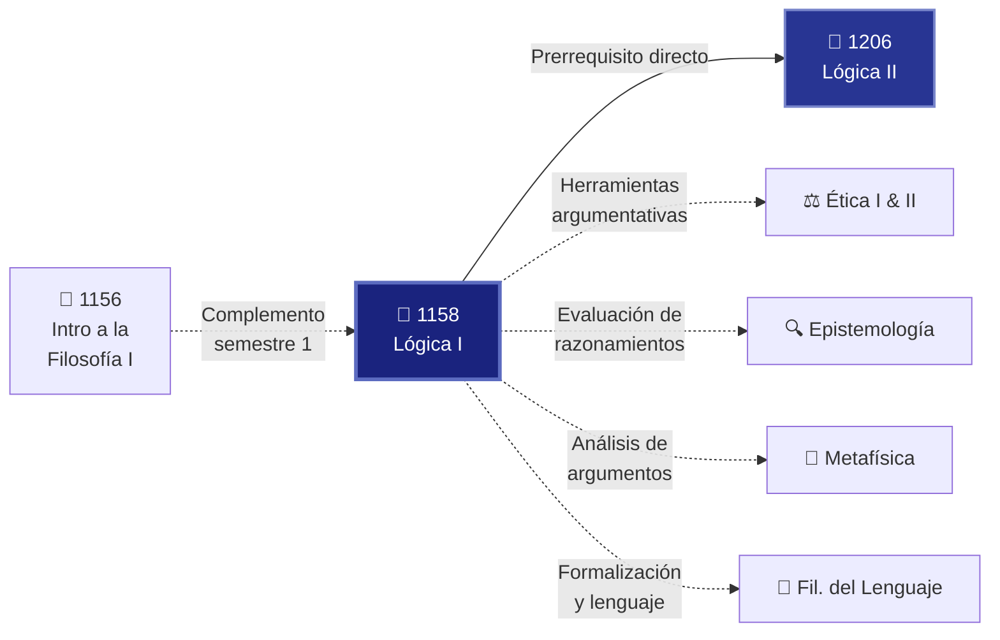

# 🔷 1158 — Lógica I

### 🎓 Licenciatura en Filosofía · Sistema Universidad Abierta y Educación a Distancia · UNAM
### Semestre 1 · Área: Lógica · Carácter: Obligatorio · Ciclo MDP: 14 días (40 hrs)

---

> *«La lógica es el principio de todos los principios, la disciplina de todas las disciplinas.»*
> — **[[Aristóteles]]**, *Analíticos segundos*, I, 2

> *«Los límites de mi lenguaje significan los límites de mi mundo.»*
> — **Ludwig Wittgenstein**, *Tractatus Logico-Philosophicus*, 5.6

---

## 📋 Ficha del Curso

| Campo | Detalle |
|:------|:--------|
| **Clave** | 1158 |
| **Nombre** | Lógica I |
| **Semestre** | 1.° (Primero) |
| **Créditos** | 8 |
| **Área** | Lógica |
| **Carácter** | Obligatorio |
| **Modalidad** | A distancia (SUAyED) |
| **Horas semanales** | 4 |
| **Ciclo MDP** | 14 días · 40 horas totales |
| **Prerrequisitos** | Ninguno |
| **Asignatura consecutiva** | [[1206 - Lógica II]] |
| **Tradición disciplinar** | [[Aristóteles]] → Leibniz → Frege → Russell → Tarski |

---

> [!IMPORTANT]
> ### 🏛️ Mandato del [[Manifiesto]]
> **La Lógica es la única materia de la carrera donde el DRILL supera a la lectura.** No se trata de «comprender» las reglas de inferencia: se trata de *ejecutarlas* con la precisión de un relojero hasta que se vuelvan reflejos. El Prof. Cornejo exigía 50-60 ejercicios de deducción natural por ciclo. Este programa los exige también. Sin práctica masiva, la lógica es letra muerta.
>
> **Los 4 pilares aplican así:**
> - 📖 **Lectura primaria** → Copi/Cohen caps. asignados por fase
> - 🏗️ **Producción intelectual** → Demostración analítica formal (no ensayo libre)
> - 🗣️ **Defensa dialéctica** → Auditoría lógica paso a paso
> - 🔄 **Auditoría mensual** → Revisión de velocidad y precisión en pruebas

---

## 📖 Descripción General

La **Lógica** es la disciplina filosófica que estudia las **formas válidas del razonamiento**. No se ocupa de *qué* pensamos, sino de *cómo* debemos estructurar nuestros pensamientos para que las conclusiones se sigan legítimamente de las premisas. Es a la filosofía lo que las matemáticas son a la física: **la herramienta de rigor** sin la cual cualquier investigación se vuelve amorfa.

**Lógica I** constituye el primer acercamiento sistemático al análisis formal del razonamiento. El curso está diseñado en **cuatro fases progresivas**: desde la anatomía del [[Argumento]] en lenguaje natural, pasando por la [[Formalización]] simbólica y las [[Tabla de verdad|tablas de verdad]], hasta la **deducción natural** con sus 19 reglas formales. El artefacto final no es un ensayo libre, sino una **demostración analítica formal** que integra las cuatro fases: un argumento filosófico clásico reconstruido, formalizado y probado.

> [!TIP]
> 💡 Quien no domina la lógica no puede evaluar críticamente ningún argumento — ni en metafísica, ni en ética, ni en epistemología. Lógica I y [[1206 - Lógica II|Lógica II]] son la **columna vertebral metodológica** de toda la carrera.

---

## 🎯 Objetivos de Aprendizaje

Al concluir este ciclo de 14 días, el estudiante será capaz de:

1. 🔹 **Identificar** la estructura argumentativa en textos filosóficos: [[Proposición|proposiciones]], premisas, conclusiones, supuestos implícitos e [[Entimema|entimemas]].
2. 🔹 **Diagramar** argumentos en lenguaje natural usando mapas de flechas (*arrow maps*).
3. 🔹 **Dominar** el vocabulario simbólico (∧, ∨, →, ↔, ¬) y traducir enunciados entre lenguaje natural y simbólico.
4. 🔹 **Construir** [[Tabla de verdad|tablas de verdad]] y determinar si una fórmula es [[Tautología]], [[Contradicción]] o contingencia.
5. 🔹 **Memorizar y aplicar** las 19 reglas de la deducción natural (9 de inferencia + 10 de reemplazo).
6. 🔹 **Realizar** demostraciones formales incluyendo **Prueba Condicional** y **Reducción al Absurdo** (*Reductio*).
7. 🔹 **Producir** una demostración analítica formal de un argumento filosófico clásico como artefacto final.

---

## 📚 Temario: Las Cuatro Fases

---

### ⚔️ FASE I — Lógica Informal y la Anatomía del Argumento
#### 📅 Días 1–4 · ⏱️ ~8–10 horas

> *«Un argumento es un conjunto de proposiciones del cual se afirma que una de ellas se sigue de las demás.»* — Irving **Copi**

| # | Tema | Descripción | ✓ |
|:-:|:-----|:------------|:-:|
| 1.1 | ¿Qué es la lógica? | La lógica como estudio de las formas válidas del razonamiento; distinción entre lógica y psicología del pensamiento | ⬜ |
| 1.2 | [[Proposición]], enunciado, oración | Qué es una [[Proposición]]; proposiciones simples y compuestas; valor de verdad | ⬜ |
| 1.3 | Premisas y conclusiones | Estructura del [[Argumento]]; indicadores lógicos (*porque, dado que, por lo tanto, se sigue que*) | ⬜ |
| 1.4 | Inferencia y [[Entimema]] | Qué es una inferencia; argumentos con premisas implícitas (entimemas); reconstrucción | ⬜ |
| 1.5 | Deducción e inducción | Argumentos deductivos vs. inductivos; certeza vs. probabilidad | ⬜ |
| 1.6 | [[Validez]], verdad y [[Solidez]] | Definiciones precisas; un argumento válido puede tener conclusión falsa; un argumento sólido es válido *y* tiene premisas verdaderas | ⬜ |
| 1.7 | Diagramación de argumentos | *Arrow maps*: técnica visual para representar la estructura de argumentos complejos | ⬜ |

**📕 Lecturas obligatorias:**
- **Copi, I. & Cohen, C.** — *Introducción a la Lógica*, capítulos 1 y 2
- **Weston, Anthony** — *Las claves de la argumentación* (completo)

**🔥 Dinámica:**
- **Días 1–2:** Lectura de Copi/Cohen caps. 1-2 y Weston completo. Definir en Anki: [[Proposición]], premisa, conclusión, inferencia, [[Entimema]].
- **Días 3–4:** **DRILL** → Diagramar al menos **15 argumentos** en lenguaje natural usando mapas de flechas. Intercambiar y corregir diagramas.

---

### ⚔️ FASE II — Lógica Simbólica y Tablas de Verdad
#### 📅 Días 5–8 · ⏱️ ~10 horas

> *«La notación conceptual pretende ser un *lingua characterica* en el sentido leibniziano.»* — Gottlob **Frege**, *Begriffsschrift* (1879)

| # | Tema | Descripción | ✓ |
|:-:|:-----|:------------|:-:|
| 2.1 | El lenguaje simbólico | Variables proposicionales (*p, q, r*...); fórmulas bien formadas (fbf) | ⬜ |
| 2.2 | Las cinco conectivas | Negación (¬), conjunción (∧), disyunción (∨), condicional (→), bicondicional (↔) | ⬜ |
| 2.3 | [[Formalización]] de argumentos | Traducción del lenguaje natural al simbólico; diccionario de formalización | ⬜ |
| 2.4 | [[Tabla de verdad|Tablas de verdad]] | Construcción mecánica; determinación del valor de verdad de fórmulas compuestas | ⬜ |
| 2.5 | [[Tautología]], [[Contradicción]], contingencia | Clasificación de fórmulas según su tabla de verdad | ⬜ |
| 2.6 | Equivalencia lógica | Dos fórmulas son lógicamente equivalentes si comparten tabla de verdad | ⬜ |
| 2.7 | [[Validez]] por tablas de verdad | Determinación de validez de argumentos mediante el método de tablas | ⬜ |

**📕 Lecturas obligatorias:**
- **Copi, I.** — *Lógica Simbólica* (capítulos iniciales sobre notación y tablas de verdad)
- **Quine, W. V. O.** — *Los métodos de la lógica* (secciones sobre conectivas lógicas)

**🔥 Dinámica:**
- **Día 5:** Aprender vocabulario simbólico (∧, ∨, →, ↔, ¬). Ejercicios de traducción lenguaje natural ↔ simbólico.
- **Días 6–8:** Memorizar tablas de verdad (**¡Anki!**). Completar ejercicios de tablas de verdad para determinar [[Tautología]]/[[Contradicción]]/Contingencia.

> [!TIP]
> 💡 **Truco para el condicional:** *p* → *q* es falso **únicamente** cuando *p* es verdadero y *q* es falso. En todos los demás casos, es verdadero. Contraintuitivo al inicio, pero es la base de todo el cálculo proposicional.

---

### ⚔️ FASE III — Deducción Natural y Pruebas de Validez
#### 📅 Días 9–12 · ⏱️ ~12 horas

> *«Demostrar es deducir a partir de premisas aceptadas, aplicando reglas explícitas.»*

| # | Tema | Descripción | ✓ |
|:-:|:-----|:------------|:-:|
| 3.1 | ¿Qué es la deducción natural? | Sistema de Gentzen/Jaśkowski; ventajas sobre el método axiomático | ⬜ |
| 3.2 | Las 9 reglas de inferencia | [[Modus Ponens]], [[Modus Tollens]], [[Silogismo Hipotético]], SD, Simp, Conj, Ad, DC, Abs | ⬜ |
| 3.3 | Las 10 reglas de reemplazo | [[De Morgan]], DN, Com, Asoc, Dist, Trans, Impl, Equiv, Exp, Taut | ⬜ |
| 3.4 | Estrategias de demostración | Trabajar «hacia atrás» desde la conclusión; identificar la regla necesaria | ⬜ |
| 3.5 | Prueba Condicional (PC) | Suponer el antecedente, derivar el consecuente, descargar el supuesto | ⬜ |
| 3.6 | Reducción al Absurdo (RAA) | Suponer la negación, derivar contradicción, concluir la afirmación original | ⬜ |

**📕 Lecturas obligatorias:**
- **Copi, I.** — *Introducción a la Lógica*, capítulos sobre Deducción Formal

**🔥 Dinámica:**
- **Día 9:** Memorizar las **19 reglas** en Anki (9 de inferencia + 10 de reemplazo). Flash intensivo.
- **Días 10–12:** **EXTREME DRILL** → Al menos **20 demostraciones formales** cada día (como exige el Prof. Cornejo: *«50-60 ejercicios»*). Incluir Prueba Condicional y Reducción al Absurdo (*Reductio*).

> [!WARNING]
> ⚠️ **Esta fase es el núcleo duro del curso.** Sin las 60+ demostraciones, NO estás preparado. La deducción natural se domina con las manos, no con los ojos. Cada demostración fallida es más valiosa que diez leídas.

---

### ⚔️ FASE IV — El Combate Dialéctico
#### 📅 Días 13–14 · ⏱️ ~8 horas

> *«La lógica se ocupa de toda clase de cosas. No hay ninguna cosa en absoluto que quede fuera de su alcance.»* — **Charles Sanders Peirce**

| # | Actividad | Descripción | ✓ |
|:-:|:----------|:------------|:-:|
| 4.1 | Selección del argumento | Elegir un argumento filosófico clásico (ej: argumento ontológico de Descartes, Cinco Vías de Tomás de Aquino, argumento del mal de Epicuro) | ⬜ |
| 4.2 | Reconstrucción en lenguaje natural | Escribir el argumento identificando premisas y conclusión (habilidad de Fase I) | ⬜ |
| 4.3 | Traducción al lenguaje simbólico | [[Formalización]] completa con diccionario (habilidad de Fase II) | ⬜ |
| 4.4 | Prueba formal de validez | Demostración usando reglas de inferencia y reemplazo (habilidad de Fase III) | ⬜ |
| 4.5 | Defensa dialéctica | Intercambio de demostraciones; el compañero actúa como **auditor lógico** | ⬜ |

> [!IMPORTANT]
> 🎯 **El artefacto de Lógica I NO es un ensayo libre.** Es una **DEMOSTRACIÓN ANALÍTICA FORMAL** que integra las cuatro fases. Ver sección completa más adelante.

---

## 📅 Calendario de 14 Días

```mermaid
gantt
    title Ciclo MDP · Lógica I · 14 días (40 hrs)
    dateFormat  X
    axisFormat Día %s

    section Fase I
    Lectura Copi/Cohen 1-2 + Weston           :f1a, 1, 2d
    DRILL - 15 diagramas de argumentos         :f1b, 3, 2d

    section Fase II
    Vocabulario simbólico + traducciones       :f2a, 5, 1d
    Tablas de verdad + Taut/Contr/Cont         :f2b, 6, 3d

    section Fase III
    Memorizar 19 reglas en Anki                :crit, f3a, 9, 1d
    EXTREME DRILL - 20+ demos/día             :crit, f3b, 10, 3d

    section Fase IV
    Demostración analítica formal              :f4a, 13, 1d
    Defensa dialéctica + auditoría             :f4b, 14, 1d
```

| Día | Fase | Actividad principal | Horas | Entregable |
|:---:|:----:|:---------------------|:-----:|:-----------|
| 1 | I | Lectura Copi/Cohen caps. 1-2 | 3 | Notas de lectura + definiciones |
| 2 | I | Lectura Weston completo; crear tarjetas Anki de conceptos básicos | 2.5 | Tarjetas Anki: proposición, premisa, conclusión, inferencia, entimema |
| 3 | I | DRILL: diagramar 8 argumentos en lenguaje natural | 2.5 | 8 *arrow maps* corregidos |
| 4 | I | DRILL: diagramar 7 argumentos más; intercambio y corrección | 2 | 7 *arrow maps* + correcciones recibidas |
| 5 | II | Aprender ¬, ∧, ∨, →, ↔; ejercicios de traducción | 2.5 | 15 traducciones natural→simbólico |
| 6 | II | Memorizar tablas de verdad (Anki); construir tablas simples | 2.5 | Tarjetas Anki de las 5 tablas + 10 tablas resueltas |
| 7 | II | Tablas de verdad compuestas; clasificar Taut/Contr/Cont | 3 | 15 fórmulas clasificadas |
| 8 | II | Validez por tablas de verdad; repaso general de Fase II | 2 | 10 argumentos evaluados por tabla |
| 9 | III | **Memorizar las 19 reglas** (9 inferencia + 10 reemplazo) en Anki | 3 | Flash de 19 reglas con esquema y ejemplo |
| 10 | III | EXTREME DRILL: 20 demostraciones formales | 3 | 20 pruebas resueltas |
| 11 | III | EXTREME DRILL: 20 demostraciones + Prueba Condicional | 3 | 20 pruebas (al menos 5 con PC) |
| 12 | III | EXTREME DRILL: 20 demostraciones + Reductio al Absurdo | 3 | 20 pruebas (al menos 5 con RAA) |
| 13 | IV | Construir la demostración analítica formal (artefacto) | 4 | Borrador completo del artefacto |
| 14 | IV | Defensa dialéctica; auditoría lógica; versión final | 4 | Artefacto final + registro de defensa |

---

## 🃏 Tarjetas Anki Sugeridas por Fase

### Fase I — Anatomía del Argumento

| # | Frente | Reverso |
|:-:|:-------|:--------|
| 1 | ¿Qué es una [[Proposición]]? | Contenido significativo de un enunciado declarativo; puede ser verdadero o falso. |
| 2 | ¿Qué es un [[Argumento]]? | Conjunto de proposiciones donde unas (premisas) pretenden fundamentar otra (conclusión). |
| 3 | ¿Qué es una premisa? | Proposición ofrecida como razón o fundamento en un argumento. |
| 4 | ¿Qué es una conclusión? | Proposición que se pretende derivar de las premisas. |
| 5 | ¿Qué es una inferencia? | Proceso por el cual se deriva una conclusión a partir de premisas. |
| 6 | ¿Qué es un [[Entimema]]? | Argumento con una o más premisas implícitas (no enunciadas). |
| 7 | ¿Diferencia entre [[Validez]] y [[Solidez]]? | Validez = la conclusión se sigue de las premisas (por la forma). Solidez = válido + premisas verdaderas. |
| 8 | Indicadores de premisa (5 ejemplos) | *porque, puesto que, dado que, ya que, pues* |
| 9 | Indicadores de conclusión (5 ejemplos) | *por lo tanto, en consecuencia, se sigue que, así que, luego* |

### Fase II — Lógica Simbólica

| # | Frente | Reverso |
|:-:|:-------|:--------|
| 10 | Símbolo de negación y lectura | **¬p** → «No p» / «No es el caso que p» |
| 11 | Símbolo de conjunción y lectura | **p ∧ q** → «p y q» |
| 12 | Símbolo de disyunción y lectura | **p ∨ q** → «p o q» (inclusiva) |
| 13 | Símbolo de condicional y lectura | **p → q** → «Si p entonces q» |
| 14 | Símbolo de bicondicional y lectura | **p ↔ q** → «p si y solo si q» |
| 15 | ¿Cuándo es falso p → q? | **Únicamente** cuando p es V y q es F |
| 16 | ¿Qué es una [[Tautología]]? | Fórmula verdadera en **toda** interpretación posible |
| 17 | ¿Qué es una [[Contradicción]]? | Fórmula falsa en **toda** interpretación posible |
| 18 | Ejemplo de tautología | p ∨ ¬p (tercero excluido) |
| 19 | Ejemplo de contradicción | p ∧ ¬p |

### Fase III — Deducción Natural (Las 19 Reglas)

| # | Frente | Reverso |
|:-:|:-------|:--------|
| 20 | [[Modus Ponens]] (MP) | p → q ; p ∴ q |
| 21 | [[Modus Tollens]] (MT) | p → q ; ¬q ∴ ¬p |
| 22 | [[Silogismo Hipotético]] (SH) | p → q ; q → r ∴ p → r |
| 23 | Silogismo Disyuntivo (SD) | p ∨ q ; ¬p ∴ q |
| 24 | Simplificación (Simp) | p ∧ q ∴ p |
| 25 | Conjunción (Conj) | p ; q ∴ p ∧ q |
| 26 | Adición (Ad) | p ∴ p ∨ q |
| 27 | Dilema Constructivo (DC) | (p→q) ∧ (r→s) ; p ∨ r ∴ q ∨ s |
| 28 | Absorción (Abs) | p → q ∴ p → (p ∧ q) |
| 29 | [[De Morgan]] (DeM) | ¬(p ∧ q) ≡ (¬p ∨ ¬q) / ¬(p ∨ q) ≡ (¬p ∧ ¬q) |
| 30 | Doble Negación (DN) | ¬¬p ≡ p |
| 31 | Conmutación (Com) | (p ∧ q) ≡ (q ∧ p) / (p ∨ q) ≡ (q ∨ p) |
| 32 | Asociación (Asoc) | (p ∧ (q ∧ r)) ≡ ((p ∧ q) ∧ r) |
| 33 | Distribución (Dist) | p ∧ (q ∨ r) ≡ (p ∧ q) ∨ (p ∧ r) |
| 34 | Transposición (Trans) | (p → q) ≡ (¬q → ¬p) |
| 35 | Implicación Material (Impl) | (p → q) ≡ (¬p ∨ q) |
| 36 | Equivalencia Material (Equiv) | (p ↔ q) ≡ (p → q) ∧ (q → p) |
| 37 | Exportación (Exp) | ((p ∧ q) → r) ≡ (p → (q → r)) |
| 38 | Tautología (Taut) | p ≡ (p ∨ p) / p ≡ (p ∧ p) |

---

## 📊 Tabla de Conectivas Lógicas

> *Referencia rápida de las cinco conectivas fundamentales del cálculo proposicional.*

| Conectiva | Símbolo | Lectura en español | Verdadera cuando… | Falsa cuando… |
|:----------|:-------:|:--------------------|:-------------------|:---------------|
| **Negación** | **¬** *p* | «No *p*» / «No es el caso que *p*» | *p* es falsa | *p* es verdadera |
| **Conjunción** | *p* **∧** *q* | «*p* y *q*» | Ambos son verdaderos | Al menos uno es falso |
| **Disyunción** | *p* **∨** *q* | «*p* o *q*» (inclusiva) | Al menos uno es verdadero | Ambos son falsos |
| **Condicional** | *p* **→** *q* | «Si *p* entonces *q*» | En todos los casos *excepto*… | *p* es verdadero y *q* es falso |
| **Bicondicional** | *p* **↔** *q* | «*p* si y solo si *q*» | Ambos tienen el mismo valor | Tienen valores distintos |

### Tablas de verdad completas

#### Negación (¬)

| *p* | ¬*p* |
|:---:|:----:|
| V | **F** |
| F | **V** |

#### Conjunción (∧)

| *p* | *q* | *p* ∧ *q* |
|:---:|:---:|:----------:|
| V | V | **V** |
| V | F | **F** |
| F | V | **F** |
| F | F | **F** |

#### Disyunción (∨)

| *p* | *q* | *p* ∨ *q* |
|:---:|:---:|:----------:|
| V | V | **V** |
| V | F | **V** |
| F | V | **V** |
| F | F | **F** |

#### Condicional (→)

| *p* | *q* | *p* → *q* |
|:---:|:---:|:---------:|
| V | V | **V** |
| V | F | **F** |
| F | V | **V** |
| F | F | **V** |

#### Bicondicional (↔)

| *p* | *q* | *p* ↔ *q* |
|:---:|:---:|:----------:|
| V | V | **V** |
| V | F | **F** |
| F | V | **F** |
| F | F | **V** |

---

## 📐 Tabla de Reglas de Inferencia

> *Las nueve reglas básicas de inferencia del sistema de deducción natural.*

| # | Regla | Esquema | Ejemplo |
|:-:|:------|:--------|:--------|
| 1 | **[[Modus Ponens]] (MP)** | *p* → *q* ; *p* ∴ *q* | «Si llueve, el suelo se moja. Llueve. ∴ El suelo se moja.» |
| 2 | **[[Modus Tollens]] (MT)** | *p* → *q* ; ¬*q* ∴ ¬*p* | «Si es mamífero, tiene sangre caliente. No tiene sangre caliente. ∴ No es mamífero.» |
| 3 | **[[Silogismo Hipotético]] (SH)** | *p* → *q* ; *q* → *r* ∴ *p* → *r* | «Si estudio, apruebo. Si apruebo, me gradúo. ∴ Si estudio, me gradúo.» |
| 4 | **Silogismo Disyuntivo (SD)** | *p* ∨ *q* ; ¬*p* ∴ *q* | «O voy al cine o estudio. No voy al cine. ∴ Estudio.» |
| 5 | **Simplificación (Simp)** | *p* ∧ *q* ∴ *p* | «Es filósofo y es lógico. ∴ Es filósofo.» |
| 6 | **Conjunción (Conj)** | *p* ; *q* ∴ *p* ∧ *q* | «Es lunes. Hace frío. ∴ Es lunes y hace frío.» |
| 7 | **Adición (Ad)** | *p* ∴ *p* ∨ *q* | «Llueve. ∴ Llueve o nieva.» |
| 8 | **Dilema Constructivo (DC)** | (*p* → *q*) ∧ (*r* → *s*) ; *p* ∨ *r* ∴ *q* ∨ *s* | «Si es perro, ladra; si es gato, maúlla. Es perro o gato. ∴ Ladra o maúlla.» |
| 9 | **Absorción (Abs)** | *p* → *q* ∴ *p* → (*p* ∧ *q*) | «Si estudias, apruebas. ∴ Si estudias, entonces estudias y apruebas.» |

---

## 🔄 Tabla de Reglas de Reemplazo (Equivalencias)

| # | Regla | Equivalencia |
|:-:|:------|:-------------|
| 1 | **[[De Morgan]] (DeM)** | ¬(*p* ∧ *q*) ≡ (¬*p* ∨ ¬*q*) &nbsp;/&nbsp; ¬(*p* ∨ *q*) ≡ (¬*p* ∧ ¬*q*) |
| 2 | **Doble Negación (DN)** | ¬¬*p* ≡ *p* |
| 3 | **Conmutación (Com)** | (*p* ∧ *q*) ≡ (*q* ∧ *p*) &nbsp;/&nbsp; (*p* ∨ *q*) ≡ (*q* ∨ *p*) |
| 4 | **Asociación (Asoc)** | (*p* ∧ (*q* ∧ *r*)) ≡ ((*p* ∧ *q*) ∧ *r*) &nbsp;/&nbsp; análogo con ∨ |
| 5 | **Distribución (Dist)** | *p* ∧ (*q* ∨ *r*) ≡ (*p* ∧ *q*) ∨ (*p* ∧ *r*) &nbsp;/&nbsp; análogo |
| 6 | **Transposición (Trans)** | (*p* → *q*) ≡ (¬*q* → ¬*p*) |
| 7 | **Implicación Material (Impl)** | (*p* → *q*) ≡ (¬*p* ∨ *q*) |
| 8 | **Equivalencia Material (Equiv)** | (*p* ↔ *q*) ≡ (*p* → *q*) ∧ (*q* → *p*) |
| 9 | **Exportación (Exp)** | ((*p* ∧ *q*) → *r*) ≡ (*p* → (*q* → *r*)) |
| 10 | **Tautología (Taut)** | *p* ≡ (*p* ∨ *p*) &nbsp;/&nbsp; *p* ≡ (*p* ∧ *p*) |

---

## ⚠️ Tabla de Falacias

| # | [[Falacia]] | Descripción | Ejemplo |
|:-:|:--------|:------------|:--------|
| 1 | **Ad hominem** (abusivo) | Atacar a la persona en lugar de su argumento | «No le hagas caso a su argumento sobre ética: es un hipócrita.» |
| 2 | **Ad verecundiam** | Apelar a una autoridad no competente en el tema | «El cambio climático no es real: lo dice este famoso actor.» |
| 3 | **Ad populum** | Apelar a la opinión de la mayoría como prueba | «Millones de personas creen en la astrología, así que debe ser verdad.» |
| 4 | **Ad ignorantiam** | Afirmar algo por la ausencia de refutación | «Nadie ha demostrado que los fantasmas no existen, luego existen.» |
| 5 | **Petitio principii** | La conclusión ya está contenida en las premisas (circular) | «Dios existe porque lo dice la Biblia, y la Biblia es verdadera porque es la palabra de Dios.» |
| 6 | **Falsa dicotomía** | Presentar solo dos opciones cuando hay más | «O estás conmigo o estás contra mí.» |
| 7 | **Pendiente resbaladiza** | Encadenar consecuencias improbables sin justificación | «Si legalizamos X, pronto se legalizará Y, luego Z, y la sociedad colapsará.» |
| 8 | **Hombre de paja** | Distorsionar el argumento del oponente para atacarlo | «Dices que hay que reducir el gasto militar; o sea, quieres que el país quede indefenso.» |
| 9 | **Falsa causa** (*post hoc*) | Inferir causalidad de mera sucesión temporal | «Después de que se rompió el espejo, tuvo mala suerte; el espejo causó la mala suerte.» |
| 10 | **Generalización apresurada** | Concluir una generalización a partir de muy pocos casos | «Conocí a dos filósofos y ambos eran distraídos. Todos los filósofos son distraídos.» |
| 11 | **Afirmación del consecuente** *(formal)* | *p* → *q* ; *q* ∴ *p* — forma inválida | «Si llueve, el suelo está mojado. El suelo está mojado. ∴ Llueve.» (Pudo ser la manguera.) |
| 12 | **Negación del antecedente** *(formal)* | *p* → *q* ; ¬*p* ∴ ¬*q* — forma inválida | «Si estudio, apruebo. No estudio. ∴ No apruebo.» (Podría aprobar de otro modo.) |

---

## 📕 Bibliografía

### Textos centrales del ciclo

| Autor | Título | Uso en el ciclo |
|:------|:-------|:----------------|
| Irving M. **Copi** & Carl **Cohen** | *Introducción a la Lógica* (Limusa/Eudeba) | **Texto eje.** Fases I, II y III. Caps. 1-2 (argumentación), caps. de lógica simbólica y deducción formal. |
| Anthony **Weston** | *Las claves de la argumentación* (Ariel) | **Fase I.** Guía práctica de argumentación en lenguaje natural. |
| W. V. O. **Quine** | *Los métodos de la lógica* (Planeta-Agostini) | **Fase II.** Secciones sobre conectivas lógicas; perspectiva complementaria. |
| Irving M. **Copi** | *Lógica Simbólica* (CECSA) | **Fases II-III.** Capítulos iniciales de notación y tablas de verdad; deducción formal. |

### Bibliografía complementaria

| Autor | Título | Notas |
|:------|:-------|:------|
| Alfredo **Deaño** | *Introducción a la lógica formal* (Alianza) | Excelente exposición de lógica proposicional; muy usado en universidades hispanohablanas. |
| Wesley **Salmon** | *Lógica* (UNAM / Ed. Coyoacán) | Breve, claro, ideal como segunda lectura introductoria. |
| Patrick **Suppes** | *Introducción a la lógica matemática* (Reverté) | Puente hacia [[1206 - Lógica II]]; más avanzado. |
| Alejandro **Herrera** & José A. **Torres** | *Falacias* (Torres Asociados) | Monografía especializada; excelente para falacias. |
| Susan **Haack** | *Filosofía de las lógicas* | Reflexión filosófica *sobre* la lógica. |
| Raymond **Smullyan** | *¿Cómo se llama este libro?* (Cátedra) | Acertijos lógicos que desarrollan la intuición formal. |

---

## 🗺️ Mapa Conceptual del Ciclo

---

## 🔗 Conexiones Curriculares

| Conexión | Descripción |
|:---------|:------------|
| **[[1156 - Introducción a la Filosofía I]]** | Complemento de semestre 1. La Intro ofrece el panorama; Lógica I da las herramientas analíticas. |
| **→ [[1206 - Lógica II]]** | Continuación directa: lógica de predicados, cuantificadores, lógica modal, metalógica. Todo lo de Lógica I es prerrequisito. |
| **↔ Epistemología** | ¿Qué cuenta como justificación? ¿Qué estructura tienen las pruebas? La lógica proporciona el marco formal. |
| **↔ Metafísica** | El argumento ontológico, el cosmológico, el del mal: todos requieren análisis lógico para ser evaluados. |
| **↔ Ética** | La ética normativa involucra argumentos que deben ser evaluados lógicamente. Detección de [[Falacia|falacias]] es crucial. |
| **↔ Filosofía del Lenguaje** | Frege, Russell, Wittgenstein: figuras centrales tanto en lógica como en filosofía del lenguaje. |

---

## 🔑 Vocabulario Clave

| # | Término | Definición breve |
|:-:|:--------|:-----------------|
| 1 | **[[Proposición]]** | Contenido significativo de un enunciado declarativo; puede ser verdadero o falso. |
| 2 | **[[Argumento]]** | Conjunto de proposiciones donde unas (premisas) pretenden fundamentar otra (conclusión). |
| 3 | **Premisa** | Proposición ofrecida como razón o fundamento en un argumento. |
| 4 | **Conclusión** | Proposición que se pretende derivar de las premisas. |
| 5 | **[[Validez]]** | Propiedad de un argumento cuya conclusión se sigue necesariamente de sus premisas (por su forma). |
| 6 | **[[Solidez]]** | Propiedad de un argumento que es válido *y* tiene todas sus premisas verdaderas. |
| 7 | **[[Tautología]]** | Fórmula lógica verdadera en toda interpretación posible. |
| 8 | **[[Contradicción]]** | Fórmula lógica falsa en toda interpretación posible. |
| 9 | **Contingencia** | Fórmula cuyo valor de verdad varía según la interpretación. |
| 10 | **Conectiva lógica** | Operador que forma proposiciones compuestas (¬, ∧, ∨, →, ↔). |
| 11 | **[[Tabla de verdad]]** | Dispositivo que muestra el valor de verdad de una fórmula compuesta para toda combinación de valores. |
| 12 | **[[Formalización]]** | Traducción de un argumento del lenguaje natural al lenguaje simbólico. |
| 13 | **[[Falacia]]** | Error en el razonamiento que hace que un argumento parezca válido sin serlo. |
| 14 | **[[Entimema]]** | Argumento con una o más premisas implícitas (no explicitadas). |
| 15 | **[[Modus Ponens]]** | Regla de inferencia: de *p* → *q* y *p*, se concluye *q*. |
| 16 | **[[Modus Tollens]]** | Regla de inferencia: de *p* → *q* y ¬*q*, se concluye ¬*p*. |
| 17 | **[[Silogismo Hipotético]]** | Regla de inferencia: de *p* → *q* y *q* → *r*, se concluye *p* → *r*. |
| 18 | **[[De Morgan]]** | Leyes de equivalencia: ¬(p ∧ q) ≡ (¬p ∨ ¬q) y ¬(p ∨ q) ≡ (¬p ∧ ¬q). |
| 19 | **Consecuencia lógica** | Relación Γ ⊨ φ: imposible que las premisas sean verdaderas y la conclusión falsa. |
| 20 | **Equivalencia lógica** | Dos fórmulas con el mismo valor de verdad en toda interpretación. |

---

## 🏋️ Zona de Práctica

> *La lógica no se aprende leyendo: se aprende haciendo.*

---

### 🔹 Ejercicios de formalización

> [!NOTE]
> **Instrucciones:** Traduce cada argumento al lenguaje simbólico de la lógica proposicional. Usa las letras indicadas como diccionario de formalización.

**Ejercicio 1:**
> «Si el alma es inmortal, entonces la muerte no es el fin. El alma es inmortal. Por lo tanto, la muerte no es el fin.»
>
> *Diccionario:* *p* = «El alma es inmortal» ; *q* = «La muerte es el fin»
>
> *Formaliza el argumento y determina qué regla de inferencia se aplica.*
>
> 

🔓 Ver solución

>
> **Formalización:** *p* → ¬*q* ; *p* ∴ ¬*q*
>
> **Regla aplicada:** [[Modus Ponens]] (MP)
> 

**Ejercicio 2:**
> «Si Sócrates es humano, entonces Sócrates es mortal. Si Sócrates es mortal, entonces Sócrates dejará de existir. Por lo tanto, si Sócrates es humano, entonces Sócrates dejará de existir.»
>
> *Diccionario:* *p* = «Sócrates es humano» ; *q* = «Sócrates es mortal» ; *r* = «Sócrates dejará de existir»
>
> 

🔓 Ver solución

>
> **Formalización:** *p* → *q* ; *q* → *r* ∴ *p* → *r*
>
> **Regla aplicada:** [[Silogismo Hipotético]] (SH)
> 

**Ejercicio 3:**
> «O bien el libre albedrío existe o bien somos máquinas determinadas. No somos máquinas determinadas. Además, si el libre albedrío existe, entonces somos moralmente responsables. Por lo tanto, somos moralmente responsables.»
>
> *Diccionario:* *p* = «El libre albedrío existe» ; *q* = «Somos máquinas determinadas» ; *r* = «Somos moralmente responsables»
>
> 

🔓 Ver solución

>
> **Formalización:**
> 1. *p* ∨ *q* &emsp; (Premisa)
> 2. ¬*q* &emsp; (Premisa)
> 3. *p* → *r* &emsp; (Premisa)
> 4. *p* &emsp; (SD: 1, 2)
> 5. *r* &emsp; (MP: 3, 4)
>
> **Reglas aplicadas:** Silogismo Disyuntivo + [[Modus Ponens]]
> 

**Ejercicio 4:**
> «Si la ética es objetiva, entonces hay verdades morales universales. Si hay verdades morales universales, entonces el relativismo moral es falso. El relativismo moral no es falso. Por lo tanto, la ética no es objetiva.»
>
> *Diccionario:* *p* = «La ética es objetiva» ; *q* = «Hay verdades morales universales» ; *r* = «El relativismo moral es falso»
>
> 

🔓 Ver solución

>
> **Formalización:**
> 1. *p* → *q* &emsp; (Premisa)
> 2. *q* → *r* &emsp; (Premisa)
> 3. ¬*r* &emsp; (Premisa)
> 4. *p* → *r* &emsp; (SH: 1, 2)
> 5. ¬*p* &emsp; (MT: 4, 3)
>
> **Reglas aplicadas:** [[Silogismo Hipotético]] + [[Modus Tollens]]
> 

---

### 🔹 Tablas de verdad para completar

> [!NOTE]
> **Instrucciones:** Completa las tablas de verdad. Determina si cada fórmula es [[Tautología|tautología]], [[Contradicción|contradicción]] o contingencia.

**Ejercicio 5:** Determina el estatus de la fórmula (*p* → *q*) ↔ (¬*q* → ¬*p*)

| *p* | *q* | ¬*q* | ¬*p* | *p* → *q* | ¬*q* → ¬*p* | (*p* → *q*) ↔ (¬*q* → ¬*p*) |
|:---:|:---:|:----:|:----:|:---------:|:------------:|:----------------------------:|
| V | V | | | | | |
| V | F | | | | | |
| F | V | | | | | |
| F | F | | | | | |

> 

🔓 Ver solución

>
> | *p* | *q* | ¬*q* | ¬*p* | *p* → *q* | ¬*q* → ¬*p* | (*p* → *q*) ↔ (¬*q* → ¬*p*) |
> |:---:|:---:|:----:|:----:|:---------:|:------------:|:----------------------------:|
> | V | V | F | F | V | V | **V** |
> | V | F | V | F | F | F | **V** |
> | F | V | F | V | V | V | **V** |
> | F | F | V | V | V | V | **V** |
>
> **Resultado:** [[Tautología|TAUTOLOGÍA]] ✅ — Esta es la ley de *transposición* (contraposición).
> 

**Ejercicio 6:** Determina el estatus de la fórmula (*p* ∧ *q*) → *p*

| *p* | *q* | *p* ∧ *q* | (*p* ∧ *q*) → *p* |
|:---:|:---:|:---------:|:------------------:|
| V | V | | |
| V | F | | |
| F | V | | |
| F | F | | |

> 

🔓 Ver solución

>
> | *p* | *q* | *p* ∧ *q* | (*p* ∧ *q*) → *p* |
> |:---:|:---:|:---------:|:------------------:|
> | V | V | V | **V** |
> | V | F | F | **V** |
> | F | V | F | **V** |
> | F | F | F | **V** |
>
> **Resultado:** [[Tautología|TAUTOLOGÍA]] ✅ — Esta tautología fundamenta la regla de *simplificación*.
> 

**Ejercicio 7:** Determina el estatus de la fórmula (*p* → *q*) → (*q* → *p*)

| *p* | *q* | *p* → *q* | *q* → *p* | (*p* → *q*) → (*q* → *p*) |
|:---:|:---:|:---------:|:---------:|:--------------------------:|
| V | V | | | |
| V | F | | | |
| F | V | | | |
| F | F | | | |

> 

🔓 Ver solución

>
> | *p* | *q* | *p* → *q* | *q* → *p* | (*p* → *q*) → (*q* → *p*) |
> |:---:|:---:|:---------:|:---------:|:--------------------------:|
> | V | V | V | V | **V** |
> | V | F | F | V | **V** |
> | F | V | V | F | **F** |
> | F | F | V | V | **V** |
>
> **Resultado:** CONTINGENCIA ⚡ — ¡Cuidado! El condicional *no* es simétrico. Confundir esto lleva a la [[Falacia|falacia]] de *afirmación del consecuente*.
> 

---

### 🔹 Ejercicios de detección de falacias

> [!NOTE]
> **Instrucciones:** Identifica qué [[Falacia|falacia]] se comete en cada caso y explica brevemente por qué.

**Ejercicio 8:**
> «El profesor García dice que el argumento ontológico de San Anselmo es inválido, pero el profesor García es ateo, así que su opinión no cuenta.»
>
> 

🔓 Ver solución

>
> **Falacia:** *Ad hominem* circunstancial. Se descalifica el argumento del profesor no por su contenido lógico, sino por una circunstancia personal (su ateísmo). Las creencias personales no afectan la [[Validez|validez]] lógica del análisis.
> 

**Ejercicio 9:**
> «Si permitimos que los estudiantes elijan libremente sus horarios, pronto querrán elegir a sus profesores, después querrán diseñar el plan de estudios, y al final la universidad se convertirá en un caos total sin ningún estándar académico.»
>
> 

🔓 Ver solución

>
> **Falacia:** *Pendiente resbaladiza* (*slippery slope*). Se encadena una serie de consecuencias cada vez más extremas sin justificar por qué cada paso llevaría necesariamente al siguiente.
> 

**Ejercicio 10:**
> «La teoría de la evolución debe ser falsa porque, si fuera verdadera, significaría que la vida no tiene propósito, y eso es una idea demasiado deprimente para aceptarla.»
>
> 

🔓 Ver solución

>
> **Falacia:** *Ad consequentiam* (apelación a las consecuencias) con elementos de *ad misericordiam*. La verdad o falsedad de una teoría no depende de si sus consecuencias nos resultan agradables.
> 

---

## 📝 Artefacto Final: Demostración Analítica Formal

> [!CAUTION]
> 🚨 **El artefacto de Lógica I NO es un ensayo libre.** Es una **DEMOSTRACIÓN ANALÍTICA FORMAL** que integra las cuatro fases del ciclo. Es el único artefacto de toda la licenciatura que tiene formato puramente lógico-formal.

### Estructura del artefacto

El artefacto tiene **cuatro partes** que corresponden exactamente a las cuatro fases:

| Parte | Fase | Contenido | Extensión aprox. |
|:-----:|:----:|:----------|:----------------:|
| **I** | Fase I | **Reconstrucción en lenguaje natural.** Tomar un argumento filosófico clásico, identificar premisas y conclusión, explicitar entimemas. | 1-2 páginas |
| **II** | Fase II | **Traducción al lenguaje simbólico.** Diccionario de formalización completo. Fórmulas bien formadas. | ½ página |
| **III** | Fase III | **Prueba formal de validez.** Demostración paso a paso usando reglas de inferencia y reemplazo. Puede incluir PC o RAA. | 1-2 páginas |
| **IV** | Fase IV | **Análisis crítico.** ¿La formalización captura la esencia del argumento original? ¿Qué se pierde? ¿Es el argumento *sólido* o solo *válido*? | 1 página |

### Argumentos filosóficos sugeridos

| Argumento | Filósofo | Dificultad |
|:----------|:---------|:----------:|
| Argumento ontológico | Descartes / San Anselmo | ⭐⭐ |
| Las Cinco Vías (Primera Vía) | Tomás de Aquino | ⭐⭐ |
| El argumento del mal | Epicuro / Mackie | ⭐⭐⭐ |
| El cogito | Descartes | ⭐ |
| El argumento de la apuesta | Pascal | ⭐⭐⭐ |
| El dilema del tranvía (formalizado) | Foot / Thomson | ⭐⭐ |

### Defensa dialéctica

La defensa **no es una presentación oral libre**. Es una **auditoría lógica**:

1. Intercambias tu demostración con un compañero.
2. El compañero actúa como **auditor lógico**: revisa cada paso de la demostración.
3. Preguntas clave del auditor:
   - ¿Se aplicó [[De Morgan]] correctamente?
   - ¿El diccionario de formalización es fiel al argumento original?
   - ¿La formalización captura la *esencia* del argumento o lo distorsiona?
   - ¿Cada paso de la prueba cita correctamente la regla utilizada?

---

## 🌐 Recursos Digitales

| Recurso | Tipo | URL | Descripción |
|:--------|:-----|:----|:------------|
| **Stanford Encyclopedia of Philosophy** — «Logic» | Enciclopedia | [plato.stanford.edu](https://plato.stanford.edu/entries/logic-classical/) | Artículo exhaustivo sobre lógica clásica. |
| **SEP** — «Informal Logic» | Enciclopedia | [plato.stanford.edu](https://plato.stanford.edu/entries/logic-informal/) | Lógica informal y teoría de la argumentación. |
| **IEP** — «Fallacies» | Enciclopedia | [iep.utm.edu](https://iep.utm.edu/fallacy/) | Catálogo completo de falacias con ejemplos. |
| **Logic Daemon** (Texas A&M) | Herramienta | [logic.tamu.edu](https://logic.tamu.edu/) | Práctica interactiva de tablas de verdad y demostraciones. |
| **Open Logic Project** | Libro abierto | [openlogicproject.org](https://openlogicproject.org/) | Texto de lógica de código abierto. |
| **Carnap.io** | Herramienta | [carnap.io](https://carnap.io/) | Ejercicios interactivos de lógica formal. |

---

## 📓 Bitácora de Trabajo por Fases

---

### Fase I — ⚔️ Anatomía del Argumento (Días 1–4)

> **Preguntas guía:**
> - ¿Puedes identificar premisas y conclusión en un párrafo de Platón?
> - ¿Qué [[Entimema|entimemas]] encontraste en tus lecturas? ¿Qué premisas estaban ocultas?
> - ¿Completaste los 15 *arrow maps*? ¿Qué patrones reconoces?

**Notas de lectura (Copi/Cohen caps. 1-2):**

_[Espacio para notas]_

**Notas de lectura (Weston):**

_[Espacio para notas]_

**Registro de diagramas:**

| Día | Diagramas completados | Diagramas corregidos | Observaciones |
|:---:|:---------------------:|:--------------------:|:--------------|
| 3 | /8 | | |
| 4 | /7 | | |

---

### Fase II — ⚔️ Lógica Simbólica (Días 5–8)

> **Preguntas guía:**
> - ¿Puedes traducir de lenguaje natural a simbólico y viceversa sin errores?
> - ¿Entiendes por qué el condicional material es verdadero cuando el antecedente es falso?
> - ¿Cuántas tablas de verdad has completado? (mínimo: 20)

**Registro de ejercicios:**

| Día | Traducciones | Tablas resueltas | Fórmulas clasificadas | Observaciones |
|:---:|:------------:|:----------------:|:---------------------:|:--------------|
| 5 | /15 | | | |
| 6 | | /10 | | |
| 7 | | /15 | /15 | |
| 8 | | /10 | | |

---

### Fase III — ⚔️ Deducción Natural (Días 9–12)

> **Preguntas guía:**
> - ¿Puedes recitar las 19 reglas de memoria?
> - ¿Distingues claramente entre reglas de inferencia y reglas de reemplazo?
> - ¿Has completado 60+ demostraciones?
> - ¿Dominas Prueba Condicional y Reductio?

> [!CAUTION]
> 🚨 **No avances a Fase IV sin completar 60 demostraciones.** Sin este DRILL masivo, la Fase IV será imposible. La deducción natural se domina con las manos, no con los ojos.

**Registro de demostraciones:**

| Día | Demos completadas | Con PC | Con RAA | Errores frecuentes |
|:---:|:-----------------:|:------:|:-------:|:-------------------|
| 10 | /20 | | | |
| 11 | /20 | /5 | | |
| 12 | /20 | | /5 | |
| **Total** | **/60** | | | |

---

### Fase IV — ⚔️ El Combate Dialéctico (Días 13–14)

> **Preguntas guía:**
> - ¿Tu formalización captura la esencia del argumento original?
> - ¿Tu demostración es verificable paso a paso?
> - ¿Resistió la auditoría de tu compañero?

**Argumento elegido:** _______________

**Estado del artefacto:**

| Parte | Estado | Notas |
|:-----:|:------:|:------|
| I. Reconstrucción natural | ⬜ | |
| II. Formalización | ⬜ | |
| III. Prueba formal | ⬜ | |
| IV. Análisis crítico | ⬜ | |
| Defensa dialéctica | ⬜ | |

---

## ❓ Preguntas No Resueltas

> *Dudas, problemas sin resolver, intuiciones que merezcan investigación posterior.*

| # | Fecha | Pregunta o problema | Fase | Resuelta |
|:-:|:------|:-------------------|:----:|:--------:|
| 1 | | | | ⬜ |
| 2 | | | | ⬜ |
| 3 | | | | ⬜ |
| 4 | | | | ⬜ |
| 5 | | | | ⬜ |

> [!TIP]
> 💡 **Preguntas para comenzar:**
> - ¿Por qué *p* → *q* es verdadero cuando *p* es falso? ¿Convención o algo más profundo?
> - ¿Los principios lógicos (no [[Contradicción|contradicción]], tercero excluido) son «leyes del pensamiento» o «leyes de la realidad»?
> - ¿Puede haber lógicas donde no valga el tercero excluido? (Spoiler: sí — la lógica intuicionista. Se verá en [[1206 - Lógica II]].)
> - ¿Cuál es la relación entre la lógica y la verdad? ¿La lógica «descubre» verdades o solo «preserva» verdades?

---

## 📔 Diario Filosófico

> *Reflexiones personales sobre el estudio de la lógica. Incluye: conexiones inesperadas, momentos de claridad, frustraciones productivas, cambios en tu forma de pensar.*

---

**Entrada 1**
- 📅 Fecha: _______________
- 🏷️ Fase: _______________

_[Escribe tu reflexión aquí]_

---

**Entrada 2**
- 📅 Fecha: _______________
- 🏷️ Fase: _______________

_[Escribe tu reflexión aquí]_

---

**Entrada 3**
- 📅 Fecha: _______________
- 🏷️ Fase: _______________

_[Escribe tu reflexión aquí]_

---

> [!NOTE]
> 📝 **Sobre el diario en Lógica:** A diferencia de otras materias donde el diario será más especulativo, aquí puede incluir reflexiones como: «Hoy entendí por qué la doble negación elimina la negación», o «Me cuesta la prueba condicional; creo que es porque no tengo clara la idea de 'supuesto'», o «Es asombroso que con solo cinco conectivas se pueda formalizar casi cualquier argumento.»

---

---

> *«En la lógica no puede haber sorpresas.»*
> — **Ludwig Wittgenstein**, *Tractatus*, 6.1251

---

*Documento generado para el sistema MDP · [[Manifiesto]] · Licenciatura en Filosofía · SUAyED UNAM*
*Ciclo de 14 días · 40 horas · Última actualización: junio 2026*
