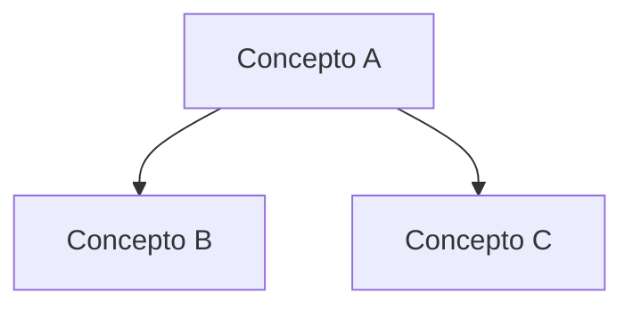

# 1848 - Materia del Área de Ontología II

## 📋 Información de la Asignatura
- **Clave:** 1848
- **Semestre:** Semestre 8
- **Área/Eje:** Ontología
- **Mapa Curricular:** Licenciatura en Filosofía (SUAyED - FFyL UNAM)

---

## 🔄 Protocolo de Inmersión Temática (Método Dialéctico de Pares)
*Utiliza esta tabla para registrar el progreso del estudio conjunto.*

| Fase | Actividad | Producto Esperado | Estado | Notas / Enlace |
| :---: | :--- | :--- | :---: | :--- |
| **1** | Reconocimiento del terreno | Documento con las 4 preguntas clave | ❌ | |
| **2** | Identificación del texto-eje | Selección y justificación del texto primario | ❌ | |
| **3** | Primera lectura, sin pretensiones | Breve resumen del movimiento del texto | ❌ | |
| **4** | Mapeo conceptual | Diagrama o mapa visual de conceptos | ❌ | |
| **5** | Segunda lectura, con escalpelo | Reconstrucción de la estructura argumentativa | ❌ | |
| **6** | Confrontación dialéctica | Discusión, objeciones y reconstrucción ajustada | ❌ | |
| **7** | Tercera lectura, en clave crítica | Ensayo crítico final (1000 - 1500 palabras) | ❌ | |

---

## 🏛️ Temario y Contenidos

### Unidades / Temas Principales
- [ ] Unidad 1: [Nombre de la Unidad 1]
- [ ] Unidad 2: [Nombre de la Unidad 2]
- [ ] Unidad 3: [Nombre de la Unidad 3]

---

## 📚 Textos y Lecturas Seleccionadas (Textos-Eje)
- **Texto Principal:**
- **Comentarios y Textos Secundarios:**

---

## 📝 Bitácora de Trabajo y Artefactos

### [Fase 1] Reconocimiento del terreno
*Preguntas guía: ¿Qué tipo de problema es? ¿Cuál es su historia? ¿Cuáles son las posiciones principales? ¿Por qué importa filosóficamente?*
> [!NOTE]
> Escribe aquí el desarrollo de la Fase 1...

### [Fase 2] Identificación del texto-eje
*Decisión razonada sobre la fuente primaria.*
> [!NOTE]
> Escribe aquí el texto seleccionado y su justificación...

### [Fase 3] Primera lectura (Movimiento del texto)
*Dos o tres frases sobre qué HACE el texto (su estrategia) en lugar de qué dice.*
> [!NOTE]
> Escribe aquí la impresión de la primera lectura...

### [Fase 4] Mapeo conceptual
*Estructura de conceptos y sus relaciones intuidas.*

### [Fase 5] Segunda lectura (Reconstrucción Argumentativa)
*Reconstrucción detallada del argumento en palabras propias.*
> [!IMPORTANT]
> **Premisa 1:** ...
> **Premisa 2:** ...
> **Conclusión:** ...

### [Fase 6] Confrontación Dialéctica
*Objeciones del par y respuestas/ajustes.*
> [!WARNING]
> **Objeción del par:** ...
> **Respuesta / Ajuste:** ...

### [Fase 7] Ensayo Crítico Final
*Ensayo de 1000 a 1500 palabras con tesis propia, argumento, objeción anticipada y respuesta.*
> [!TIP]
> Escribe aquí el ensayo final o enlázalo si es un archivo externo...

---

## ❓ Preguntas no Resueltas (Registro Persistente)
*Anota aquí las dudas acumuladas durante las sesiones.*
1.
